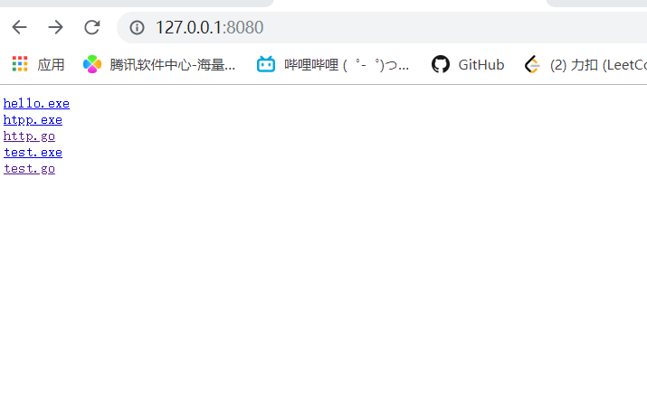

安装 : [liunx下安装](<http://c.biancheng.net/view/3993.html>)


## go语言的特点

1. 引入包的概念，go语言的每一个文件都要属于一个包，不能单独存在

2. 引入垃圾回收机制，内存自动回收

3. 天然并发(支持大并发)

   - 从语言层面支持并发，实现简单
   - 从**goroutine**，轻量级线程，可实现大并发处理，高效利用多核
   - 基于CPS并发模型实现

4. 吸收管道通信机制，**channel**，可以实现不同goroutine的通信

5. go函数可以支持返回多个值

   ```go
   func getSumAndSub(n1 int,n2 int) (int,int){
       sum := n1 + n2 // go语句后面不需要分号
       sub := n1 - n2
       return sum,sub
   }
   ```

6. 增加切片 slice ,延迟执行 defer


编译:`go build hello.go` `./hello`

​         或者 `go run hello.go`


```
go build  -o myhello.exe hello.go
```


编译时，编译器将程序依赖运行的库文件包含在可执行文件中，所以可执行文件可以在没go环境的机器上运行


```
package main

import (
        "fmt"
        "math/rand"
        "time"
)

// 数据生产者
func producer(header string, channel chan<- string) {
     // 无限循环, 不停地生产数据
     for {
            // 将随机数和字符串格式化为字符串发送给通道
            channel <- fmt.Sprintf("%s: %v", header, rand.Int31())
            // 等待1秒
            time.Sleep(time.Second)
        }
}

// 数据消费者
func customer(channel <-chan string) {
     // 不停地获取数据
     for {
            // 从通道中取出数据, 此处会阻塞直到信道中返回数据
            message := <-channel
            // 打印数据
            fmt.Println(message)
        }
}

func main() {
    // 创建一个字符串类型的通道
    channel := make(chan string)
    // 创建producer()函数的并发goroutine
    go producer("cat", channel)
    go producer("dog", channel)
    // 数据消费函数
    customer(channel)
}
/*
对代码的分析：
第03行，导入格式化（fmt）、随机数（math/rand）、时间（time）包参与编译。
第10行，生产数据的函数，传入一个标记类型的字符串及一个只能写入的通道。
第13行，for{}构成一个无限循环。
第15行，使用rand.Int31()生成一个随机数，使用fmt.Sprintf()函数将header和随机数格式化为字符串。
第18行，使用time.Sleep()函数暂停1秒再执行这个函数。如果在goroutine中执行时，暂停不会影响其他goroutine的执行。
第23行，消费数据的函数，传入一个只能写入的通道。
第26行，构造一个不断消费消息的循环。
第28行，从通道中取出数据。
第31行，将取出的数据进行打印。
第35行，程序的入口函数，总是在程序开始时执行。
第37行，实例化一个字符串类型的通道。
第39行和第40行，并发执行一个生产者函数，两行分别创建了这个函数搭配不同参数的两个goroutine。
第42行，执行消费者函数通过通道进行数据消费。

整段代码中，没有线程创建，没有线程池也没有加锁，仅仅通过关键字 go 实现 goroutine，和通道实现数据交换。
*/
```

【实例】HTTP 文件服务器是常见的 Web 服务之一。开发阶段为了测试，需要自行安装 Apache 或 Nginx 服务器，下载安装配置需要大量的时间。使用 Go语言实现一个简单的 HTTP 服务器只需要几行代码，如下所示。

```
package main

import (
    "net/http"
)

func main() {
    http.Handle("/", http.FileServer(http.Dir(".")))
    http.ListenAndServe(":8080", nil)
}

/*
下面是代码说明：
第 1 行，标记当前文件为 main 包，main 包也是 Go 程序的入口包。
第 3~5 行，导入 net/http 包，这个包的作用是 HTTP 的基础封装和访问。
第 7 行，程序执行的入口函数 main()。
第 8 行，使用 http.FileServer 文件服务器将当前目录作为根目录（/目录）的处理器，访问根目录，就会进入当前目录。
第 9 行，默认的 HTTP 服务侦听在本机 8080 端口。
*/
```



## Go语言工程结构简单

Go语言的源码无须头文件，编译的文件都来自于后缀名为`.go`的源码文件。

Go语言无须解决方案、工程文件和 Make File，只要将工程文件按照 `GOPATH` 的规则进行填充，即可使用 go build/go install 进行编译，编译安装的二进制可执行文件统一放在 bin 文件夹下。

后面的章节会介绍 GOPATH 及 go build/go install 的详细使用方法。

`for循环`

```
for a := 0;a<10;a++{
    // 循环代码
}
```

`if判断`

```
if 表达式{
    // 表达式成立
}
```

`自增i++`

在 Go语言中，自增操作符不再是一个操作符，而是一个语句,只有`i++`

| 目录名 | 说明                                                         |
| ------ | ------------------------------------------------------------ |
| api    | 每个版本的 api 变更差异                                      |
| bin    | go 源码包编译出的编译器（go）、文档工具（godoc）、格式化工具（gofmt） |
| blog   | Go 博客的模板，使用 Go 的网页模板，有一定的学习意义          |
| doc    | 英文版的 Go 文档                                             |
| lib    | 引用的一些库文件                                             |
| misc   | 杂项用途的文件，例如 [Android](http://c.biancheng.net/android/) 平台的编译、git 的提交钩子等 |
| pkg    | Windows 平台编译好的中间文件                                 |
| src    | 标准库的源码                                                 |
| test   | 测试用例                                                     |

# 1. GO 语言的基本语法

## 1.1 go语言变量的声明（使用var关键字）

声明变量的一般形式是使用 var 关键字：`var 变量名 变量类型 `

例如 `var a, b *int`

Go语言的基本类型有：

- bool
- string
- int、int8、int16、int32、int64
- uint、uint8、uint16、uint32、uint64、uintptr
- byte // uint8 的别名
- rune // int32 的别名 代表一个 Unicode 码
- float32、float64
- complex64、complex128

当一个变量被声明之后，系统自动赋予它该类型的零值：int 为 0，float 为 0.0，bool 为 false，string 为空字符串，指针为 nil 等。

**所有的内存在 Go 中都是经过初始化的**

变量的命名规则遵循骆驼命名法，即首个单词小写，每个新单词的首字母大写，例如：numShips 和 startDate 。

使用关键字var和括号，可以将一组变量定义放在一起。

```
var (
    a int
    b string
    c []float32
    d func() bool
    e struct {
        x int
    }
)
```

除 var 关键字外，还可使用更加简短的变量定义和初始化语法。

`名字 := 表达式`

需要注意的是，简短模式（short variable declaration）有以下限制：

- 定义变量，同时显式初始化。
- 不能提供数据类型。
- 只能用在函数内部。

和 var 形式声明语句一样，简短变量声明语句也可以用来声明和初始化一组变量：

`i, j := 0, 1`

```
func main() {
   x:=100
   a,s:=1, "abc"
}
```

## 1.2 变量的初始化

标准写法 : `var 变量名 类型 = 表达式`

例如 `var hp int = 100`	

编译器推导类型的格式 ：  `var hp = 100`

默认0.17为高精度 float64


短变量声明并初始化 ：`hp :=100`

  这是 Go 语言的推导声明写法，编译器会自动根据右值类型推断出左值的对应类型。

注意：由于使用了`:=`，而不是赋值的`=`，因此推导声明写法的左值变量必须是没有定义过的变量。若定义过，将会发生编译错误。  

注意：在多个短变量声明和赋值中，至少有一个新声明的变量出现在左值中，即便其他变量名可能是重复声明的，编译器也不会报错，代码如下：

```
conn, err := net.Dial("tcp", "127.0.0.1:8080")
conn2, err := net.Dial("tcp", "127.0.0.1:8080")
```

上面的代码片段，编译器不会报err重复定义。


多重赋值

```
var a int = 100
var b int = 200
b, a = a, b
fmt.Println(a, b)


200 100
```

 多重赋值时，变量的左值和右值按从左到右的顺序赋值。

多重赋值在 Go 语言的错误处理和函数返回值中会大量地使用。  

## 2.3 匿名变量

匿名变量特定是一个下划线"_" ,任何值都可以被赋给他，但是会被抛弃，不会再后续代码中使用该变量

```go
func GetData() (int, int) {
    return 100, 200
}

a, _ := GetData()
_, b := GetData()

fmt.Println(a, b)

代码说明如下：
第 5 行只需要获取第一个返回值，所以将第二个返回值的变量设为下画线。
第 6 行将第一个返回值的变量设为匿名。
```

**匿名变量不占用命名空间，不会分配内存。匿名变量与匿名变量之间也不会因为多次声明而无法使用。**

## 2.4 变量的作用域

  一个变量（常量、类型或函数）在程序中都有一定的作用范围，称之为作用域。如果一个变量在函数体外声明，则被认为是全局变量，可以在整个包甚至外部包（被导出后）使用，不管你声明在哪个源文件里或在哪个源文件里调用该变量。

在函数体内声明的变量称之为局部变量，它们的作用域只在函数体内，参数和返回值变量也是局部变量。在今后的学习中我们将会学习到像 if 和 for 这些控制结构，而在这些结构中声明的变量的作用域只在相应的代码块内。一般情况下，局部变量的作用域可以通过代码块（用大括号括起来的部分）判断。  

不要将作用域和生命周期混为一谈。声明语句的作用域对应的是一个源代码的文本区域；它是一个编译时的属性。一个变量的生命周期是指程序运行时变量存在的有效时间段，在此时间区域内它可以被程序的其他部分引用；是一个运行时的概念。


和 for 循环类似，if 和 switch 语句也会在条件部分创建隐式词法域，还有它们对应的执行体词法域。下面的 if-else 测试链演示了 x 和 y 的有效作用域范围：

```go
if x := f(); x == 0 {
    fmt.Println(x)
} else if y := g(x); x == y {
    fmt.Println(x, y)
} else {
    fmt.Println(x, y)
}
fmt.Println(x, y) // 编译错误: x 和 y 未定义

第二个 if 语句嵌套在第一个内部，因此第一个 if 语句条件初始化词法域声明的变量在第二个 if 中也可以访问。switch 语句的每个分支也有类似的词法域规则：条件部分为一个隐式词法域，然后每个是每个分支的词法域。
```

```go
if f, err := os.Open(fname); err != nil { // 编译错误: unused: f
    return err
}
f.ReadByte() // 编译错误: undefined f
f.Close()    // 编译错误: undefined f
```

【例子 】获取当前的工作目录然后保存到一个包级的变量中。这可以本来通过直接调用 os.Getwd 完成

如果要正确更新包级变量，最好不用 `:=` 

```go
var cwd string

func init() {
    var err error    //通过单独声明 err 变量，来避免使用 := 的简短声明方式：
    cwd, err = os.Getwd()
    if err != nil {
        log.Fatalf("os.Getwd failed: %v", err)
    }
}
```

在二进制传输、读写文件的结构描述时，为了保持文件的结构不会受到不同编译目标平台字节长度的影响，不要使用 int 和 uint。

小数点前面或后面的数字都可能被省略（例如 .707 或 1.）。很小或很大的数最好用科学计数法书写，通过 e 或 E 来指定指数部分：

```
const Avogadro = 6.02214129e23  // 阿伏伽德罗常数
const Planck   = 6.62606957e-34 // 普朗克常数
```

用 Printf 函数的 %g 参数打印浮点数，将采用更紧凑的表示形式打印，并提供足够的精度，但是对应表格的数据，使用 %e（带指数）或 %f 的形式打印可能更合适。所有的这三个打印形式都可以指定打印的宽度和控制打印精度。

内置的 complex 函数用于构建复数，内建的 real 和 imag 函数分别返回复数的实部和虚部：

```go
var x complex128 = complex(1, 2) // 1+2i
var y complex128 = complex(3, 4) // 3+4i
fmt.Println(x*y)                 // "(-5+10i)"
fmt.Println(real(x*y))           // "-5"
fmt.Println(imag(x*y))           // "10"
```

  函数 real(c) 和 imag(c) 可以分别获得相应的实数和虚数部分。

在使用格式化说明符时，可以使用 %v 来表示复数，但当你希望只表示其中的一个部分的时候需要使用 %f。

复数支持和其它数字类型一样的运算。当你使用等号 == 或者不等号 != 对复数进行比较运算时，注意对精确度的把握。cmath 包中包含了一些操作复数的公共方法。如果你对内存的要求不是特别高，最好使用 complex128 作为计算类型，因为相关函数都使用这个类型的参数。  

## 2.5 sin图像

  在 Go 语言中，正弦函数由 math 包提供，函数入口为 math.Sin。正弦函数的参数为 float64，返回值也是 float64。在使用正弦函数时，根据实际精度可以进行转换。

Go 语言的标准库支持对图片像素进行访问，并且支持输出各种图片格式，如 JPEG、PNG、GIF 等。  

```go
package main

import (
    "image"
    "image/color"
    "image/png"
    "log"
    "math"
    "os"
)

func main() {
	
	//  设置图片背景色
	
	
    // 图片大小
    const size = 300
    // 根据给定大小创建灰度图
    pic := image.NewGray(image.Rect(0, 0, size, size))

    // 遍历每个像素
    for x := 0; x < size; x++ {
        for y := 0; y < size; y++ {
            // 填充为白色
            pic.SetGray(x, y, color.Gray{255})
        }
    }
    /*
    代码说明如下：
    第 2 行，声明一个 size 常量，值为 300。
    第 5 行，使用 image 包的 NewGray() 函数创建一个图片对象，使用区域由 image.Rect 结构提供。image.Rect 描述一个方形的两个定位点 (x1,y1) 和 (x2,y2)。image.Rect(0,0,size,size) 表示使用完整灰度图像素，尺寸为宽 300，长 300。
    第 8 行和第 9 行，遍历灰度图的所有像素。
    第 11 行，将每一个像素的灰度设为 255，也就是白色。
    */
    
    //   绘制正弦函数轨迹
    
    
    // 从0到最大像素生成x坐标
    for x := 0; x < size; x++ {

        // 让sin的值的范围在0~2Pi之间
        s := float64(x) * 2 * math.Pi / size

        // sin的幅度为一半的像素。向下偏移一半像素并翻转
        y := size/2 - math.Sin(s)*size/2

        // 用黑色绘制sin轨迹
        pic.SetGray(x, int(y), color.Gray{0})
    }

	//  写入图片文件
	
	
    // 创建文件
    file, err := os.Create("sin.png")

    if err != nil {
        log.Fatal(err)
    }
    // 使用png格式将数据写入文件
    png.Encode(file, pic) //将image信息写入文件中

    // 关闭文件
    file.Close()
    /*
    第 2 行，创建 sin.png 的文件。
    第 4 行，如果创建文件失败，返回错误，打印错误并终止。
    第 8 行，使用 PNG 包，将图形对象写入文件中。
    第 11 行，关闭文件。
    */
}
```


## 2.6 bool 类型

布尔值可以和 &&（AND）和 ||（OR）操作符结合，并且有短路行为：如果运算符左边值已经可以确定整个布尔表达式的值，那么运算符右边的值将不再被求值，因此下面的表达式总是安全的：

`s != "" && s[0] == 'x'`

布尔值并不会隐式转换为数字值 0 或 1，反之亦然。不允许布尔类型强制转换int

``` go
flag:=true
fmt.Println((flag)*1) // 会报错
```


如果需要经常做类似的转换, 包装成一个函数会更方便:

```go
// 如果b为真，btoi返回1；如果为假，btoi返回0
func btoi(b bool) int {
    if b {
        return 1
    }
    return 0
}
```

数字到布尔型的逆转换则非常简单, 不过为了保持对称, 我们也可以包装一个函数:

```go
// itob报告是否为非零。
func itob(i int) bool { return i != 0 }
```


## 2.7 字符串

字符串是一种值类型，且值不可变，即创建某个文本后你无法再次修改这个文本的内容；更深入地讲，字符串是字节的定长数组。

该类字符串使用反引号`` ` 括起来，支持换行，例如：

`This is a raw string \n` 中的 `\n` 会被原样输出。

和 C/C++ 不一样，Go 中的字符串是根据长度限定，而非特殊字符 \0。string 类型的零值为长度为零的字符串，即空字符串 ""。

字符串的内容（纯字节）可以通过标准索引法来获取，在中括号 [] 内写入索引，索引从 0 开始计数：

- 字符串 str 的第 1 个字节：str[0]
- 第 i 个字节：str[i - 1]
- 最后 1 个字节：str[len(str)-1]

需要注意的是，这种转换方案只对纯 ASCII 码的字符串有效。

> 注意：获取字符串中某个字节的地址的行为是非法的，例如：&str[i]。

两个字符串 s1 和 s2 可以通过 s := s1 + s2 拼接在一起。s2 追加在 s1 尾部并生成一个新的字符串 s。

拼接的简写形式 += 也可以用于字符串：

```
s := "hel" + "lo,"
s += "world!"
fmt.Println(s) //输出 “hello, world!”
```

如果需要在源码中嵌入一个多行字符串时，就必须使用```字符，代码如下

```go
const str = ` 第一行
第二行
第三行
\r\n
`
fmt.Println(str)
```

```
第一行
第二行
第三行
\r\n
```

`Go语言计算字符串长度——len()和RuneCountInString()`

```
tip1 := "genji is a ninja"
fmt.Println(len(tip1))

tip2 := "忍者"
fmt.Println(len(tip2))
```

```
16
6
```

len() 函数的返回值的类型为 int，表示字符串的 

ASCII

 字符个数或字节长度。

- 输出中第一行的 16 表示 tip1 的字符个数为 16。
- 输出中第二行的 6 表示 tip2 的字符格式，也就是“忍者”的字符个数是 6，然而根据习惯，“忍者”的字符个数应该是 2。

  这里的差异是由于 Go 语言的字符串都以 UTF-8 格式保存，每个中文占用 3 个字节，因此使用 len() 获得两个中文文字对应的 6 个字节。

如果希望按习惯上的字符个数来计算，就需要使用 Go 语言中 UTF-8 包提供的 RuneCountInString() 函数，统计 Uncode 字符数量。

下面的代码展示如何计算UTF-8的字符个数。  

```
fmt.Println(utf8.RuneCountInString("忍者"))
fmt.Println(utf8.RuneCountInString("龙忍出鞘,fight!"))
```

```
2
11
```

#### 总结

- ASCII 字符串长度使用 len() 函数。
- Unicode 字符串长度使用 `utf8.RuneCountInString() `函数。

`按Unicode字符遍历字符串`

```
theme := "狙击 start"

for _, s := range theme {
    fmt.Printf("Unicode: %c  %d\n", s, s)
}
```

```
Unicode: 狙  29401
Unicode: 击  20987
Unicode:    32
Unicode: s  115
Unicode: t  116
Unicode: a  97
Unicode: r  114
Unicode: t  116
```

#### 总结

- ASCII 字符串遍历直接使用下标。
- Unicode 字符串遍历用 for range。

`Go语言字符串截取（获取字符串的某一段字符）`

```go
tracer := "死神来了, 死神bye bye"
comma := strings.Index(tracer, ", ")

pos := strings.Index(tracer[comma:], "死神")

fmt.Println(comma, pos, tracer[comma+pos:])

代码说明如下：
1) 第 2 行尝试在 tracer 的字符串中搜索中文的逗号，返回的位置存在 comma 变量中，类型是 int，表示从 tracer 字符串开始的 ASCII 码位置。

strings.Index() 函数并没有像其他语言一样，提供一个从某偏移开始搜索的功能。不过我们可以对字符串进行切片操作来实现这个逻辑。

2) 第4行中，tracer[comma:] 从 tracer 的 comma 位置开始到 tracer 字符串的结尾构造一个子字符串，返回给 string.Index() 进行再索引。得到的 pos 是相对于 tracer[comma:] 的结果。

comma 逗号的位置是 12，而 pos 是相对位置，值为 3。我们为了获得第二个“死神”的位置，也就是逗号后面的字符串，就必须让 comma 加上 pos 的相对偏移，计算出 15 的偏移，然后再通过切片 tracer[comma+pos:] 计算出最终的子串，获得最终的结果：“死神bye bye”。
```

```
12 3 死神bye bye
```

#### 总结

字符串索引比较常用的有如下几种方法：

- strings.Index：正向搜索子字符串。
- strings.LastIndex：反向搜索子字符串。
- 搜索的起始位置可以通过切片偏移制作。

`Go语言修改字符串`

Go 语言的字符串无法直接修改每一个字符元素，只能通过重新构造新的字符串并赋值给原来的字符串变量实现。请参考下面的代码：

```go
angel := "Heros never die"

angleBytes := []byte(angel)

for i := 5; i <= 10; i++ {
    angleBytes[i] = ' '
}

fmt.Println(string(angleBytes))

代码说明如下：
在第 3 行中，将字符串转为字符串数组。
第 5～7 行利用循环，将 never 单词替换为空格。
最后打印结果。
```

```
Heros       die
```

  字符串不可变有很多好处，如天生线程安全，大家使用的都是只读对象，无须加锁；再者，方便内存共享，而不必使用写时复制（Copy On Write）等技术；字符串 hash 值也只需要制作一份。

所以说，代码中实际修改的是 []byte，[]byte 在 Go 语言中是可变的，本身就是一个切片。

在完成了对 []byte 操作后，在第 9 行，使用 string() 将 []byte 转为字符串时，重新创造了一个新的字符串。  

#### 总结

- Go 语言的字符串是不可变的。
- 修改字符串时，可以将字符串转换为 []byte 进行修改。
- []byte 和 string 可以通过强制类型转换互转。

`Go语言字符串拼接（连接）`

除了加号连接字符串，Go 语言中也有类似于 StringBuilder 的机制来进行高效的字符串连接，例如：

```go
hammer := "吃我一锤"

sickle := "死吧"

// 声明字节缓冲
var stringBuilder bytes.Buffer

// 把字符串写入缓冲
stringBuilder.WriteString(hammer)
stringBuilder.WriteString(sickle)

// 将缓冲以字符串形式输出
fmt.Println(stringBuilder.String())
```

`  bytes.Buffer` 是可以缓冲并可以往里面写入各种字节数组的。字符串也是一种字节数组，使用 `WriteString() `方法进行写入。

将需要连接的字符串，通过调用 `WriteString() `方法，写入` stringBuilder` 中，然后再通过 `stringBuilder.String()` 方法将缓冲转换为字符串。  

**Go语言fmt.Sprintf（格式化输出）**

`fmt.Sprintf(格式化样式, 参数列表…)`

- 格式化样式：字符串形式，格式化动词以`%`开头。
- 参数列表：多个参数以逗号分隔，个数必须与格式化样式中的个数一一对应，否则运行时会报错。

```
var progress = 2
var target = 8

// 两参数格式化
title := fmt.Sprintf("已采集%d个药草, 还需要%d个完成任务", progress, target)

fmt.Println(title)

pi := 3.14159
// 按数值本身的格式输出
variant := fmt.Sprintf("%v %v %v", "月球基地", pi, true)

fmt.Println(variant)

// 匿名结构体声明, 并赋予初值
profile := &struct {
    Name string
    HP   int
}{
    Name: "rat",
    HP:   150,
}

fmt.Printf("使用'%%+v' %+v\n", profile)

fmt.Printf("使用'%%#v' %#v\n", profile)

fmt.Printf("使用'%%T' %T\n", profile)
```

```
已采集2个药草, 还需要8个完成任务
"月球基地" 3.14159 true
使用'%+v' &{Name:rat HP:150}
使用'%#v' &struct { Name string; HP int }{Name:"rat", HP:150}
使用'%T' *struct { Name string; HP int }
```

| 动  词 | 功  能                                   |
| ------ | ---------------------------------------- |
| %v     | 按值的本来值输出                         |
| %+v    | 在 %v 基础上，对结构体字段名和值进行展开 |
| %#v    | 输出 Go 语言语法格式的类型和值           |
| %T     | 输出 Go 语言语法格式的类型               |
| %%     | 输出 % 本体                              |
| %b     | 整型以二进制方式显示                     |
| %o     | 整型以八进制方式显示                     |
| %d     | 整型以十进制方式显示                     |
| %x     | 整型以十六进制方式显示                   |
| %X     | 整型以十六进制、字母大写方式显示         |
| %U     | Unicode 字符                             |
| %f     | 浮点数                                   |
| %p     | 指针，十六进制方式显示                   |

**Go语言Base64编码——电子邮件的基础编码格式**

  Base64 编码是常见的对 8 比特字节码的编码方式之一。Base64 可以使用 64 个可打印字符来表示二进制数据，电子邮件就是使用这种编码。

Go 语言的标准库自带了 Base64 编码算法，通过几行代码就可以对数据进行编码，示例代码如下。  

```
package main

import (
    "encoding/base64"
    "fmt"
)

func main() {

    // 需要处理的字符串
    message := "Away from keyboard. https://golang.org/"

    // 编码消息
    encodedMessage := base64.StdEncoding.EncodeToString([]byte (message))

    // 输出编码完成的消息
    fmt.Println(encodedMessage)

    // 解码消息
    data, err := base64.StdEncoding.DecodeString(encodedMessage)

    // 出错处理
    if err != nil {
        fmt.Println(err)
    } else {
        // 打印解码完成的数据
        fmt.Println(string(data))
    }
}

代码说明如下：
第 11 行为需要编码的消息，消息可以是字符串，也可以是二进制数据。
第 14 行，base64 包有多种编码方法，这里使用 base64.StdEnoding 的标准编码方法进行编码。传入的字符串需要转换为字节数组才能供这个函数使用。
第 17 行，编码完成后一定会输出字符串类型，打印输出。
第 20 行，解码时可能会发生错误，使用 err 变量接收错误。
第 24 行，出错时，打印错误。
第 27 行，正确时，将返回的字节数组（[]byte）转换为字符串。
```

## 2.8 Go语言字符类型（byte和rune）

Go语言的字符有以下两种：

- 一种是 uint8 类型，或者叫 byte 型，代表了 [ASCII](http://c.biancheng.net/c/ascii/) 码的一个字符。
- 另一种是 rune 类型，代表一个 UTF-8 字符。当需要处理中文、日文或者其他复合字符时，则需要用到 rune 类型。rune 类型实际是一个 int32。

因为 Unicode 至少占用 2 个字节，所以我们使用 int16 或者 int 类型来表示。如果需要使用到 4 字节，则会加上 \U 前缀；前缀 \u 则总是紧跟着长度为 4 的 16 进制数，前缀 \U 紧跟着长度为 8 的 16 进制数。

```go
var ch int = '\u0041'
var ch2 int = '\u03B2'
var ch3 int = '\U00101234'
fmt.Printf("%d - %d - %d\n", ch, ch2, ch3) // integer
fmt.Printf("%c - %c - %c\n", ch, ch2, ch3) // character
fmt.Printf("%X - %X - %X\n", ch, ch2, ch3) // UTF-8 bytes
fmt.Printf("%U - %U - %U", ch, ch2, ch3)   // UTF-8 code point
```

```
65 - 946 - 1053236
A - β - r
41 - 3B2 - 101234
U+0041 - U+03B2 - U+101234
```

格式化说明符 %c 用于表示字符；当和字符配合使用时，%v 或 %d 会输出用于表示该字符的整数；%U 输出格式为 U+hhhh 的字符串。

包 unicode 包含了一些针对测试字符的非常有用的函数（其中 ch 代表字符）：

- 判断是否为字母：unicode.IsLetter(ch)
- 判断是否为数字：unicode.IsDigit(ch)
- 判断是否为空白符号：unicode.IsSpace(ch)

这些函数返回一个布尔值。包 utf8 拥有更多与 rune 相关的函数。

## 2.9 Go语言数据类型转换

在必要以及可行的情况下，一个类型的值可以被转换成另一种类型的值。由于 [Go语言](http://c.biancheng.net/golang/)不存在隐式类型转换，因此所有的转换都必须显式说明，就像调用一个函数一样（类型在这里的作用可以看作是一种函数）：

类型 B 的值 = 类型 B(类型 A 的值)

当从一个取值范围较大的转换到取值范围较小的类型时（例如将 int32 转换为 int16 或将 float32 转换为 int），会发生精度丢失（截断）的情况。

## 2.10 Go语言指针详解

指针（pointer）概念在 Go 语言中被拆分为两个核心概念：

- 类型指针，允许对这个指针类型的数据进行修改。传递数据使用指针，而无须拷贝数据。类型指针不能进行偏移和运算。
- 切片，由指向起始元素的原始指针、元素数量和容量组成。

  受益于这样的约束和拆分，Go 语言的指针类型变量拥有指针的高效访问，但又不会发生指针偏移，从而避免非法修改关键性数据问题。同时，垃圾回收也比较容易对不会发生偏移的指针进行检索和回收。

切片比原始指针具备更强大的特性，更为安全。切片发生越界时，运行时会报出宕机，并打出堆栈，而原始指针只会崩溃。  


**认识指针地址和指针类型**

  一个指针变量可以指向任何一个值的内存地址它指向那个值的内存地址，在 32 位机器上占用 4 个字节，在 64 位机器上占用 8 个字节，并且与它所指向的值的大小无关。当然，可以声明指针指向任何类型的值来表明它的原始性或结构性；你可以在指针类型前面加上 * 号（前缀）来获取指针所指向的内容，这里的 * 号是一个类型更改器。使用一个指针引用一个值被称为间接引用。

当一个指针被定义后没有分配到任何变量时，它的值为 nil。一个指针变量通常缩写为 ptr。

每个变量在运行时都拥有一个地址，这个地址代表变量在内存中的位置。Go 语言中使用`&`作符放在变量前面对变量进行“取地址”操作。  

`ptr := &v    // v的类型为T`

其中 v 代表被取地址的变量，被取地址的 v 使用 ptr 变量进行接收，ptr 的类型就为`*T`，称做 T 的指针类型。`*`代表指针。

```go
package main

import (
    "fmt"
)

func main() {
    var cat int = 1
    var str string = "banana"
    fmt.Printf("%p %p", &cat, &str)
}

代码说明如下：
第 8 行，声明整型 cat 变量。
第 9 行，声明字符串 str 变量。
第 10 行，使用 fmt.Printf 的动词%p输出 cat 和 str 变量取地址后的指针值，指针值带有0x的十六进制前缀。
```

```
0xc042052088 0xc0420461b0
```

对指针使用`*`操作，也就是指针取值

```go

package main

import (
    "fmt"
)

func main() {

    // 准备一个字符串类型
    var house = "Malibu Point 10880, 90265"

    // 对字符串取地址, ptr类型为*string
    ptr := &house

    // 打印ptr的类型
    fmt.Printf("ptr type: %T\n", ptr)

    // 打印ptr的指针地址
    fmt.Printf("address: %p\n", ptr)

    // 对指针进行取值操作
    value := *ptr

    // 取值后的类型
    fmt.Printf("value type: %T\n", value)

    // 指针取值后就是指向变量的值
    fmt.Printf("value: %s\n", value)

}
/*
代码说明如下：
第 10 行，准备一个字符串并赋值。
第 13 行，对字符串取地址，将指针保存到 ptr 中。
第 16 行，打印 ptr 变量的类型，类型为 *string。
第 19 行，打印 ptr 的指针地址，每次运行都会发生变化。
第 22 行，对 ptr 指针变量进行取值操作，value 变量类型为 string。
第 25 行，打印取值后 value 的类型。
第 28 行，打印 value 的值。
*/
```

```
ptr type: *string
address: 0xc0420401b0
value type: string
value: Malibu Point 10880, 90265
```

变量、指针地址、指针变量、取地址、取值的相互关系和特性如下：

- 对变量进行取地址（&）操作，可以获得这个变量的指针变量。
- 指针变量的值是指针地址。
- 对指针变量进行取值（*）操作，可以获得指针变量指向的原变量的值。

**示例：使用指针变量获取命令行的输入信息**

Go 语言的 flag 包中，定义的指令以指针类型返回。通过学习 flag 包，可以深入了解指针变量在设计上的方便之处。

```go
package main

// 导入系统包
import (
    "flag"
    "fmt"
)

// 定义命令行参数
var mode = flag.String("mode", "", "process mode")

func main() {

    // 解析命令行参数
    flag.Parse()

    // 输出命令行参数
    fmt.Println(*mode)
}

代码说明如下：
第 10 行，通过 flag.String，定义一个 mode 变量，这个变量的类型是 *string。后面 3 个参数分别如下：
参数名称：在给应用输入参数时，使用这个名称。
参数值的默认值：与 flag 所使用的函数创建变量类型对应，String 对应字符串、Int 对应整型、Bool 对应布尔型等。
参数说明：使用 -help 时，会出现在说明中。
第 15 行，解析命令行参数，并将结果写入创建的指令变量中，这个例子中就是 mode 变量。
第 18 行，打印 mode 指针所指向的变量。
```

将这段代码命名为main.go，然后使用如下命令行运行：

`$ go run flagparse.go --mode=fast`

输出   `fast`

由于之前使用 flag.String 已经注册了一个 mode 的命令行参数，flag 底层知道怎么解析命令行，并且将值赋给 mode*string 指针。在 Parse 调用完毕后，无须从 flag 获取值，而是通过自己注册的 mode 这个指针，获取到最终的值。代码运行流程如下图所示。


**创建指针的另一种方法——new() 函数**

```
str := new(string)
*str = "ninja"

fmt.Println(*str)
```

new() 函数可以创建一个对应类型的指针，创建过程会分配内存。被创建的指针指向的值为默认值。

## 2.11 Go语言变量逃逸分析

Go 语言将这个过程整合到编译器中，命名为“变量逃逸分析”。这个技术由编译器分析代码的特征和代码生命期，决定应该如何堆还是栈进行内存分配，即使程序员使用 Go 语言完成了整个工程后也不会感受到这个过程。

#### 1) 逃逸分析

使用下面的代码来展现 Go 语言如何通过命令行分析变量逃逸，代码如下：

```go
package main

import "fmt"

// 本函数测试入口参数和返回值情况
func dummy(b int) int {

    // 声明一个c赋值进入参数并返回
    var c int
    c = b

    return c
}

// 空函数, 什么也不做
func void() {

}

func main() {

    // 声明a变量并打印
    var a int

    // 调用void()函数
    void()

    // 打印a变量的值和dummy()函数返回
    fmt.Println(a, dummy(0))
}
/*
第 6 行，dummy() 函数拥有一个参数，返回一个整型值，测试函数参数和返回值分析情况。
第 9 行，声明 c 变量，这里演示函数临时变量通过函数返回值返回后的情况。
第 16 行，这是一个空函数，测试没有任何参数函数的分析情况。
第 23 行，在 main() 中声明 a 变量，测试 main() 中变量的分析情况。
第 26 行，调用 void() 函数，没有返回值，测试 void() 调用后的分析情况。
第 29 行，打印 a 和 dummy(0) 的返回值，测试函数返回值没有变量接收时的分析情况。
*/
```

接着使用如下命令行运行上面的代码：

`$ go run -gcflags "-m -l" main.go`

使用 go run 运行程序时，`-gcflags` 参数是编译参数。其中 -m 表示进行内存分配分析，-l 表示避免程序内联，也就是避免进行程序优化。

```
# command-line-arguments
./main.go:29:13: a escapes to heap
./main.go:29:22: dummy(0) escapes to heap
./main.go:29:13: main ... argument does not escape
0 0

输出第 2 行告知“main 的第 29 行的变量 a 逃逸到堆”。
第 3 行告知“dummy(0)调用逃逸到堆”。由于 dummy() 函数会返回一个整型值，这个值被 fmt.Println 使用后还是会在其声明后继续在 main() 函数中存在。
第 4 行，这句提示是默认的，可以忽略。
```

#### 2) 取地址发生逃逸

下面的例子使用结构体做数据，了解在堆上分配的情况，代码如下：

```go
package main

import "fmt"

// 声明空结构体测试结构体逃逸情况
type Data struct {
}

func dummy() *Data {

    // 实例化c为Data类型
    var c Data

    //返回函数局部变量地址
    return &c
}

func main() {

    fmt.Println(dummy())
}
/*
代码说明如下：
第 6 行，声明一个空的结构体做结构体逃逸分析。
第 9 行，将 dummy() 函数的返回值修改为 *Data 指针类型。
第 12 行，将 c 变量声明为 Data 类型，此时 c 的结构体为值类型。
第 15 行，取函数局部变量 c 的地址并返回。Go 语言的特性允许这样做。
第 20 行，打印 dummy() 函数的返回值。
*/
```

```
$ go run -gcflags "-m -l" main.go
# command-line-arguments
./main.go:15:9: &c escapes to heap
./main.go:12:6: moved to heap: c
./main.go:20:19: dummy() escapes to heap
./main.go:20:13: main ... argument does not escape
&{}
```

  注意第 4 行出现了新的提示：将 c 移到堆中。这句话表示，Go 编译器已经确认如果将 c 变量分配在栈上是无法保证程序最终结果的。如果坚持这样做，dummy() 的返回值将是 Data 结构的一个不可预知的内存地址。这种情况一般是 C/C++ 语言中容易犯错的地方：引用了一个函数局部变量的地址。

Go 语言最终选择将 c 的 Data 结构分配在堆上。然后由垃圾回收器去回收 c 的内存。  

编译器觉得变量应该分配在堆和栈上的原则是：

- 变量是否被取地址。
- 变量是否发生逃逸。

## 2.12 Go语言变量的生命周期

变量的生命周期指的是在程序运行期间变量有效存在的时间间隔。对于在包一级声明的变量来说，它们的生命周期和整个程序的运行周期是一致的。而相比之下，局部变量的声明周期则是动态的：每次从创建一个新变量的声明语句开始，直到该变量不再被引用为止，然后变量的存储空间可能被回收。函数的参数变量和返回值变量都是局部变量。它们在函数每次被调用的时候创建。


  那么 [Go语言](http://c.biancheng.net/golang/)的自动垃圾收集器是如何知道一个变量是何时可以被回收的呢？这里我们可以避开完整的技术细节，基本的实现思路是，从每个包级的变量和每个当前运行函数的每一个局部变量开始，通过指针或引用的访问路径遍历，是否可以找到该变量。如果不存在这样的访问路径，那么说明该变量是不可达的，也就是说它是否存在并不会影响程序后续的计算结果。

因为一个变量的有效周期只取决于是否可达，因此一个循环迭代内部的局部变量的生命周期可能超出其局部作用域。同时，局部变量可能在函数返回之后依然存在。

编译器会自动选择在栈上还是在堆上分配局部变量的存储空间，但可能令人惊讶的是，这个选择并不是由用 var 还是 new 声明变量的方式决定的。  

```go
var global *int
 
func f() {  
    var x int // x在堆上，从f函数中逃逸
    x = 1
    global = &x
}

func g() { 
    y := new(int)
    *y = 1
}
```

  f 函数里的 x 变量必须在堆上分配，因为它在函数退出后依然可以通过包一级的 global 变量找到，虽然它是在函数内部定义的；用 Go语言的术语说，这个 x 局部变量从函数 f 中逃逸了。

相反，当 g 函数返回时，变量 *y 将是不可达的，也就是说可以马上被回收的。因此，*y 并没有从函数 g 中逃逸，编译器可以选择在栈上分配 *y 的存储空间（译注：也可以选择在堆上分配，然后由 Go语言的 GC 回收这个变量的内存空间），虽然这里用的是 new 方式。  

## 2.13 Go语言常量和const关键字

[Go语言](http://c.biancheng.net/golang/)中的常量使用关键字 const 定义，用于存储不会改变的数据。常量是在编译时被创建，即使被定义为函数局部的也如此，并且只能是布尔型、数字型（整数型、浮点型和复数）和字符串型。由于编译时的限制，定义常量的表达式必须为能被编译器求值的常量表达式。

在 Go 语言中，你可以省略类型说明符 [type]，因为编译器可以根据变量的值来推断其类型。

- 显式类型定义： const b string = "abc"
- 隐式类型定义： const b = "abc"

常量的值必须是能够在编译时就能够确定的；可以在其赋值表达式中涉及计算过程，但是所有用于计算的值必须在编译期间就能获得。

- 正确的做法：const c1 = 2/3
- 错误的做法：const c2 = getNumber() // 引发构建错误: getNumber() 用做值

和变量声明一样，可以批量声明多个常量；这比较适合声明一组相关的常量：

```go
const (
    e  = 2.7182818
    pi = 3.1415926
)
```

如果是批量声明的常量，除了第一个外其它的常量右边的初始化表达式都可以省略，如果省略初始化表达式则表示使用前面常量的初始化表达式写法，对应的常量类型也一样的。例如：

```go
const (
    a = 1
    b
    c = 2
    d
)

fmt.Println(a, b, c, d) // "1 1 2 2"
```

**iota 常量生成器**

常量声明可以使用 iota 常量生成器初始化，它用于生成一组以相似规则初始化的常量，但是不用每行都写一遍初始化表达式。在一个 const 声明语句中，在第一个声明的常量所在的行，iota 将会被置为 0，然后在每一个有常量声明的行加一。

【示例 1】首先定义一个 Weekday 命名类型，然后为一周的每天定义了一个常量，从周日 0 开始。在其它编程语言中，这种类型一般被称为枚举类型。

```go
type Weekday int

const (
    Sunday Weekday = iota
    Monday
    Tuesday
    Wednesday
    Thursday
    Friday
    Saturday
)
```

iota 不仅只生成每次增加 1 的枚举值。我们还可以利用 iota 来做一些强大的枚举常量值生成器。下面的代码可以方便生成标志位常量：

```go
const (
    FlagNone = 1 << iota
    FlagRed
    FlagGreen
    FlagBlue
)

fmt.Printf("%d %d %d\n", FlagRed, FlagGreen, FlagBlue)
fmt.Printf("%b %b %b\n", FlagRed, FlagGreen, FlagBlue)

代码说明如下：
第 2 行中 iota 使用了一个移位操作，每次将上一次的值左移一位，以做出每一位的常量值。
第 8 行，将 3 个枚举按照常量输出，分别输出 2、4、8，都是将 1 每次左移一位的结果。
第 9 行，将枚举值按二进制格式输出，可以清晰地看到每一位的变化。
```

```
2 4 8
10 100 1000
```

将枚举值转换为字符串

```go
package main

import "fmt"

// 声明芯片类型
type ChipType int

const (
    None ChipType = iota
    CPU    // 中央处理器
    GPU    // 图形处理器
)

func (c ChipType) String() string {
    switch c {
    case None:
        return "None"
    case CPU:
        return "CPU"
    case GPU:
        return "GPU"
    }

    return "N/A"
}

func main() {

    // 输出CPU的值并以整型格式显示
    fmt.Printf("%s %d", CPU, CPU)
}

/*
代码说明如下：
第 6 行，将 int 声明为 ChipType 芯片类型。
第 9 行，将 const 里定义的一句常量值设为 ChipType 类型，且从 0 开始，每行值加 1。
第 14 行，定义 ChipType 类型的方法 String()，返回字符串。
第 15～22 行，使用 switch 语句判断当前的 ChitType 类型的值，返回对应的字符串。
第 30 行，输出 CPU 的值并按整型格式输出。
*/
```

```
CPU 1
```

使用 String() 方法的 ChipType 在使用上和普通的常量没有区别。当这个类型需要显示为字符串时，Go 语言会自动寻找 String() 方法并进行调用。


**无类型常量**

许多常量并没有一个明确的基础类型，编译器为这些没有明确的基础类型的数字常量提供比基础类型更高精度的算术运算；

通过延迟明确常量的具体类型，无类型的常量不仅可以提供更高的运算精度，而且可以直接用于更多的表达式而不需要显式的类型转换。

对于常量面值，不同的写法可能会对应不同的类型。例如 0、0.0、0i 和 \u0000 虽然有着相同的常量值，但是它们分别对应无类型的整数、无类型的浮点数、无类型的复数和无类型的字符等不同的常量类型。同样，true 和 false 也是无类型的布尔类型，字符串面值常量是无类型的字符串类型。

## 2.14 Go语言type关键字（类型别名）

在 Go 1.9 版本之前的内建类型定义的代码是这样写的：

```
type byte uint8
type rune int32
```

而在 Go 1.9 版本之后变为：

```
type byte = uint8
type rune = int32
```

这个修改就是配合类型别名而进行的修改。

类型别名的写法为：

`type TypeAlias = Type`

类型定义的写法

`type TypeAlias  Type`

类型别名与类型定义表面上看只有一个等号的差异，那么它们之间实际的区别有哪些呢？下面通过一段代码来理解。

```go
package main

import (
    "fmt"
)

// 将NewInt定义为int类型
type NewInt int

// 将int取一个别名叫IntAlias
type IntAlias = int

func main() {

    // 将a声明为NewInt类型
    var a NewInt
    // 查看a的类型名
    fmt.Printf("a type: %T\n", a)

    // 将a2声明为IntAlias类型
    var a2 IntAlias
    // 查看a2的类型名
    fmt.Printf("a2 type: %T\n", a2)
}

/*
代码说明如下：
第 8 行，将 NewInt 定义为 int 类型，这是常见定义类型的方法，通过 type 关键字的定义，NewInt 会形成一种新的类型。NewInt 本身依然具备int的特性。
第 11 行，将 IntAlias 设置为 int 的一个别名，使用 IntAlias 与 int 等效。
第 16 行，将 a 声明为 NewInt 类型，此时若打印，则 a 的值为 0。
第 18 行，使用%T格式化参数，显示 a 变量本身的类型。
第 21 行，将 a2 声明为 IntAlias 类型，此时打印 a2 的值为 0。
第 23 行，显示 a2 变量的类型。
*/
```

```
a type: main.NewInt
a2 type: int
```

tAlias 类型只会在代码中存在，编译完成时，不会有 IntAlias 类型。

**非本地类型不能定义方法**

```go
package main

import (
    "time"
)

// 定义time.Duration的别名为MyDuration
type MyDuration = time.Duration

// 为MyDuration添加一个函数
func (m MyDuration) EasySet(a string) {

}

func main() {

}
/*
代码说明如下：
第 8 行，使用类型别名为 time.Duration 设定一个别名叫 MyDuration。
第 11 行，为这个别名添加一个方法。
*/
```

编译上面代码报错，信息如下：

`cannot define new methods on non-local type time.Duration`

编译器提示：不能在一个非本地的类型 time.Duration 上定义新方法。非本地方法指的就是使用 time.Duration 的代码所在的包，也就是 main 包。因为 time.Duration 是在 time 包中定义的，在 main 包中使用。time.Duration 包与 main 包不在同一个包中，因此不能为不在一个包中的类型定义方法。

解决这个问题有下面两种方法：

- 将第 8 行修改为 type MyDuration time.Duration，也就是将 MyDuration 从别名改为类型。
- 将 MyDuration 的别名定义放在 time 包中。

# 3 Go语言容器（container）

## 3.1 Go语言数组详解

`var a [3]int   // 定义三个整数的数组`

数组的每个元素都可以通过索引下标来访问，索引下标的范围是从 0 开始到数组长度减 1 的位置。内置的 len 函数将返回数组中元素的个数。

```go
var a [3]int             // 定义三个整数的数组
fmt.Println(a[0])        // 打印第一个元素
fmt.Println(a[len(a)-1]) // 打印最后一个元素

// 打印索引和元素
for i, v := range a {
    fmt.Printf("%d %d\n", i, v)
}

// 仅打印元素
for _, v := range a {
    fmt.Printf("%d\n", v)
}
```

默认情况下，数组的每个元素都被初始化为元素类型对应的零值，对于数字类型来说就是 0。同时也可以使用数组字面值语法用一组值来初始化数组：

```go
var q [3]int = [3]int{1, 2, 3}
var r [3]int = [3]int{1, 2}
fmt.Println(r[2]) // "0"
```

在数组字面值中，如果在数组的长度位置出现的是“...”省略号，则表示数组的长度是根据初始化值的个数来计算。因此，上面 q 数组的定义可以简化为：

```go
q := [...]int{1, 2, 3}
fmt.Printf("%T\n", q) // "[3]int"
```

在这种形式的数组字面值形式中，初始化索引的顺序是无关紧要的，而且没用到的索引可以省略，和前面提到的规则一样，未指定初始值的元素将用零值初始化。例如，

```go
r := [...]int{99: -1}

定义了一个含有 100 个元素的数组 r，最后一个元素被初始化为 -1，其它元素都是用 0 初始化。
```

## 3.2 Go语言多维数组简述

```go
// 声明一个二维整型数组，两个维度分别存储 4 个元素和 2 个元素
var array [4][2]int
// 使用数组字面量来声明并初始化一个二维整型数组
array := [4][2]int{{10, 11}, {20, 21}, {30, 31}, {40, 41}}
// 声明并初始化外层数组中索引为 1 个和 3 的元素
array := [4][2]int{1: {20, 21}, 3: {40, 41}}
// 声明并初始化外层数组和内层数组的单个元素
array := [4][2]int{1: {0: 20}, 3: {1: 41}}
```

## 3.3 Go语言切片详解

切片（slice）是对数组一个连续片段的引用（该数组我们称之为相关数组，通常是匿名的），所以切片是一个引用类型.这个片段可以是整个数组，或者是由起始和终止索引标识的一些项的子集。需要注意的是，终止索引标识的项不包括在切片内。

在 [Go语言](http://c.biancheng.net/golang/)中 Slice 代表变长的序列，序列中每个元素都有相同的类型。一个 slice 类型一般写作 []T，其中 T 代表 slice 中元素的类型；slice 的语法和数组很像，只是没有固定长度而已。

Go语言切片的内部结构包含地址、大小和容量。切片一般用于快速地操作一块数据集合。如果将数据集合比作切糕的话，切片就是你要的“那一块”。切的过程包含从哪里开始（这个就是切片的地址）及切多大（这个就是切片的大小）。容量可以理解为装切片的口袋大小，如下图所示。


`slice [开始位置:结束位置]`

- slice 表示目标切片对象。
- 开始位置对应目标切片对象的索引。
- 结束位置对应目标切片的结束索引,   终止索引标识的项不包括在切片内。。

```go
var a  = [3]int{1, 2, 3}
fmt.Println(a, a[1:2])
```

```
[1 2 3]  [2]
```

从数组或切片生成新的切片拥有如下特性：

- 取出的元素数量为：结束位置-开始位置。
- 取出元素不包含结束位置对应的索引，切片最后一个元素使用 slice[len(slice)] 获取。
- 当缺省开始位置时，表示从连续区域开头到结束位置。
- 当缺省结束位置时，表示从开始位置到整个连续区域末尾。
- 两者同时缺省时，与切片本身等效。
- 两者同时为0时，等效于空切片，一般用于切片复位。

**直接声明新的切片**

除了可以从原有的数组或者切片中生成切片，你也可以声明一个新的切片。每一种类型都可以拥有其切片类型，表示多个类型元素的连续集合。因此切片类型也可以被声明。切片类型声明格式如下：

`var name []T`

- name 表示切片类型的变量名。
- T 表示切片类型对应的元素类型。

```go
// 声明字符串切片
var strList []string

// 声明整型切片
var numList []int

// 声明一个空切片
var numListEmpty = []int{}
//numListEmpty 已经被分配到了内存，但没有元素，因此和 nil 比较时是 false。


// 输出3个切片
fmt.Println(strList, numList, numListEmpty)

// 输出3个切片大小
fmt.Println(len(strList), len(numList), len(numListEmpty))

// 切片判定空的结果
fmt.Println(strList == nil)
fmt.Println(numList == nil)
fmt.Println(numListEmpty == nil)
```

```
[] [] []
0 0 0
true
true
false
```

**使用 make() 函数构造切片**

如果需要动态地创建一个切片，可以使用 make() 内建函数，格式如下：

`make( []T, size, cap )`

- T：切片的元素类型。
- size：就是为这个类型分配多少个元素。
- cap：预分配的元素数量，这个值设定后不影响 size，只是能提前分配空间，降低多次分配空间造成的性能问题。

```go
a := make([]int, 2)
b := make([]int, 2, 10)

fmt.Println(a, b)
fmt.Println(len(a), len(b))
```

```
[0 0] [0 0]
2 2
```

  a 和 b 均是预分配 2 个元素的切片，只是 b 的内部存储空间已经分配了 10 个，但实际使用了 2 个元素。

容量不会影响当前的元素个数，因此 a 和 b 取 len 都是 2。  

**使用 make() 函数生成的切片一定发生了内存分配操作**。但给定开始与结束位置（包括切片复位）的切片只是将新的切片结构指向已经分配好的内存区域，设定开始与结束位置，不会发生内存分配操作。

切片不一定必须经过 make() 函数才能使用。生成切片、声明后使用 append() 函数均可以正常使用切片。  

Go语言的内建函数 append() 可以为切片动态添加元素，代码如下所示：

```go
var a []int
a = append(a, 1) // 追加1个元素
a = append(a, 1, 2, 3) // 追加多个元素, 手写解包方式
a = append(a, []int{1,2,3}...) // 追加一个切片, 切片需要解包
```

不过要注意的是，在容量不足的情况下， append 的操作会导致重新分配内存（扩容），可能导致巨大的内存分配和复制数据代价。即使容量足够，依然需要用 append 函数的返回值来更新切片本身，因为新切片的长度已经发生了变化。

在开头一般都会导致内存的重新分配，而且会导致已有的元素全部复制 1 次。因此，从切片的开头添加元素的性能一般要比从尾部追加元素的性能差很多。

## 3.5 Go语言copy()：切片复制（切片拷贝）

```go
slice1 := []int{1, 2, 3, 4, 5}
slice2 := []int{5, 4, 3}
copy(slice2, slice1) // 只会复制slice1的前3个元素到slice2中
copy(slice1, slice2) // 只会复制slice2的3个元素到slice1的前3个位置
```

copy 函数将返回成功复制的元素的个数，等于两个 slice 中较小的长度，所以我们不用担心覆盖会超出目标 slice 的范围。

## 3.6 Go语言从切片中删除元素

Go语言并没有对删除切片元素提供专用的语法或者接口，需要使用切片本身的特性来删除元素。根据要删除元素的位置有三种情况：从开头位置删除，从中间位置删除，从尾部删除。其中删除切片尾部的元素最快：

```go
a = []int{1, 2, 3}
a = a[:len(a)-1] // 删除尾部1个元素
a = a[:len(a)-N] // 删除尾部N个元素
```

删除开头的元素可以直接移动数据指针：

```go
a = []int{1, 2, 3}
a = a[1:] // 删除开头1个元素
a = a[N:] // 删除开头N个元素
```

删除开头的元素也可以不移动数据指针，但是将后面的数据向开头移动。可以用 append 原地完成（所谓原地完成是指在原有的切片数据对应的内存区间内完成，不会导致内存空间结构的变化）：

```go
a = []int{1, 2, 3}
a = append(a[:0], a[1:]...) // 删除开头1个元素
a = append(a[:0], a[N:]...) // 删除开头N个元素
```

对于删除中间的元素，需要对剩余的元素进行一次整体挪动，同样可以用 append 或 copy 原地完成：

```go
a = []int{1, 2, 3, ...}
a = append(a[:i], a[i+1:]...) // 删除中间1个元素
a = append(a[:i], a[i+N:]...) // 删除中间N个元素
a = a[:i+copy(a[i:], a[i+1:])] // 删除中间1个元素
a = a[:i+copy(a[i:], a[i+N:])] // 删除中间N个元素
```

## 3.7 Go语言range关键字：循环迭代切片

既然切片是一个集合，那么就可以迭代其中的元素。[Go语言](http://c.biancheng.net/golang/)有个特殊的关键字 range，它可以配合关键字 for 来迭代切片里的元素，如下所示：

```go
// 创建一个整型切片
// 其长度和容量都是 4 个元素
slice := []int{10, 20, 30, 40}
// 迭代每一个元素，并显示其值
for index, value := range slice {
    fmt.Printf("Index: %d Value: %d\n", index, value)
}
```

```
Index: 0 Value: 10
Index: 1 Value: 20
Index: 2 Value: 30
Index: 3 Value: 40
```

当迭代切片时，关键字 range 会返回两个值。第一个值是当前迭代到的索引位置，第二个值是该位置对应元素值的一份副本，如下图所示。

【示例 1】range 提供了每个元素的副本

```go
// 创建一个整型切片
// 其长度和容量都是4 个元素
slice := []int{10, 20, 30, 40}
// 迭代每个元素，并显示值和地址
for index, value := range slice {
    fmt.Printf("Value: %d Value-Addr: %X ElemAddr: %X\n",
    value, &value, &slice[index])
}
```

```
Value: 10 Value-Addr: 10500168 ElemAddr: 1052E100
Value: 20 Value-Addr: 10500168 ElemAddr: 1052E104
Value: 30 Value-Addr: 10500168 ElemAddr: 1052E108
Value: 40 Value-Addr: 10500168 ElemAddr: 1052E10C
```

## 2.8 Go语言多维切片简述


【示例】组合切片的切片

```go
// 创建一个整型切片的切片
slice := [][]int{{10}, {100, 200}}
// 为第一个切片追加值为 20 的元素
slice[0] = append(slice[0], 20)
```

Go语言里使用 append 函数处理追加的方式很简明：先增长切片，再将新的整型切片赋值给外层切片的第一个元素。当上面代码中的操作完成后，会为新的整型切片分配新的底层数组，然后将切片复制到外层切片的索引为 0 的元素，如下图所示。


## 2.9 Go语言map（Go语言映射）

Go语言中 map 是一种特殊的数据结构：一种元素对（pair）的无序集合，pair 的一个元素是 key，对应的另一个元素是 value，所以这个结构也称为关联数组或字典。这是一种快速寻找值的理想结构：给定 key，对应的 value 可以迅速定位。

map 这种数据结构在其他编程语言中也称为字典（Python）、hash 和 HashTable 等。

map 是引用类型，可以使用如下声明：

```
var map1 map[keytype]valuetype

var map1 map[string]int
```

其中：

- keytype 为键类型。
- valuetype 是键对应的值类型。

> 提示：[keytype] 和 valuetype 之间允许有空格，但是 gofmt（格式化代码工具）会移除空格。

在声明的时候不需要知道 map 的长度，map 是可以动态增长的。未初始化的 map 的值是 nil。

key 可以是任意可以用 == 或者 != 操作符比较的类型，比如 string、int、float。所以数组、切片和结构体不能作为 key，但是指针和接口类型可以。如果要用结构体作为 key 可以提供 Key() 和 Hash() 方法，这样可以通过结构体的域计算出唯一的数字或者字符串的 key。

value 可以是任意类型的；通过使用空接口类型，我们可以存储任意值，但是使用这种类型作为值时需要先做一次类型断言。

map 传递给函数的代价很小：在 32 位机器上占 4 个字节，64 位机器上占 8 个字节，无论实际上存储了多少数据。通过 key 在 map 中寻找值是很快的，比线性查找快得多，但是仍然比从数组和切片的索引中直接读取要慢 100 倍；所以如果很在乎性能的话还是建议用切片来解决问题。

  map 也可以用函数作为自己的值，这样就可以用来做分支结构：key 用来选择要执行的函数。

如果 key1 是 map1 的 key，那么 map1[key1] 就是对应 key1 的值，就如同数组索引符号一样（数组可以视为一种简单形式的 map，key 是从 0 开始的整数）。

key1 对应的值可以通过赋值符号来设置为`val1：map1[key1] = val1`。

令`v: = map1[key1]`可以将 key1 对应的值赋值为 v；如果 map 中没有 key1 存在，那么 v 将被赋值为 map1 的值类型的空值。

常用的 len(map1) 方法可以获得 map 中的 pair 数目，这个数目是可以伸缩的，因为 map-pairs 在运行时可以动态添加和删除。  

```go
package main
import "fmt"

func main() {
    var mapLit map[string]int
    //var mapCreated map[string]float32
    var mapAssigned map[string]int
    mapLit = map[string]int{"one": 1, "two": 2}
    mapCreated := make(map[string]float32)
    mapAssigned = mapLit// map是引用类型，这句话相当于给mapLit起别名
    mapCreated["key1"] = 4.5
    mapCreated["key2"] = 3.14159
    mapAssigned["two"] = 3 // maplit的值也修改了
    fmt.Printf("Map literal at \"one\" is: %d\n", mapLit["one"])
    fmt.Printf("Map created at \"key2\" is: %f\n", mapCreated["key2"])
    fmt.Printf("Map assigned at \"two\" is: %d\n", mapLit["two"])
    fmt.Printf("Map literal at \"ten\" is: %d\n", mapLit["ten"])
}
```

```\
Map literal at "one" is: 1
Map created at "key2" is: 3.14159
Map assigned at "two" is: 3
Mpa literal at "ten" is: 0
```

map 是引用类型的： 内存用 make 方法来分配。

map 的初始化：`var map1[keytype]valuetype = make(map[keytype]valuetype)`，简写为：`map1 := make(map[keytype]valuetype)` 。

  不要使用 new，永远用 make 来构造 map

注意：如果错误的使用 new() 分配了一个引用对象，你会获得一个空引用的指针，相当于声明了一个未初始化的变量并且取了它的地址

**map 容量**

和数组不同，map 可以根据新增的 key-value 对动态的伸缩，因此它不存在固定长度或者最大限制。但是也可以选择标明 map 的初始容量 capacity，格式如下：

`make(map[keytype]valuetype, cap) `。

例如：

`map2 := make(map[string]float, 100)`

当 map 增长到容量上限的时候，如果再增加新的 key-value 对，map 的大小会自动加 1。所以出于性能的考虑，对于大的 map 或者会快速扩张的 map，即使只是大概知道容量，也最好先标明。

**用切片作为 map 的值**

  既然一个 key 只能对应一个 value，而 value 又是一个原始类型，那么如果一个 key 要对应多个值怎么办？例如，当我们要处理 unix 机器上的所有进程，以父进程（pid 为整形）作为 key，所有的子进程（以所有子进程的 pid 组成的切片）作为 value。通过将 value 定义为 []int 类型或者其他类型的切片，就可以优雅的解决这个问题。

这里有一些定义这种 map 的例子：  

```go
mp1 := make(map[int][]int)
mp2 := make(map[int]*[]int)
```

**Go语言遍历map（访问map中的每一个键值对）**

```go
scene := make(map[string]int)

scene["route"] = 66
scene["brazil"] = 4
scene["china"] = 960

for k, v := range scene {
    fmt.Println(k, v)
}
```

只遍历键时，使用下面的形式：

```
for k := range scene {
```

如果需要特定顺序的遍历结果，正确的做法是排序，代码如下：\

```go
scene := make(map[string]int)

// 准备map数据
scene["route"] = 66
scene["brazil"] = 4
scene["china"] = 960

// 声明一个切片保存map数据
var sceneList []string

// 将map数据遍历复制到切片中
for k := range scene {
    sceneList = append(sceneList, k)
}

// 对切片进行排序
sort.Strings(sceneList)

// 输出
fmt.Println(sceneList)
```

```
[brazil china route]
```

## 2.10 Go语言map元素的删除和清空

**使用 delete() 函数从 map 中删除键值对**

使用 delete() 内建函数从 map 中删除一组键值对，delete() 函数的格式如下：`delete(map, 键)`

- map 为要删除的 map 实例。
- 键为要删除的 map 键值对中的键。

**清空 map 中的所有元素**

有意思的是，Go 语言中并没有为 map 提供任何清空所有元素的函数、方法。清空 map 的唯一办法就是重新 make 一个新的 map。不用担心垃圾回收的效率，Go 语言中的并行垃圾回收效率比写一个清空函数高效多了

## 2.11 Go语言sync.Map（在并发环境中使用的map）

Go 语言中的 map 在并发情况下，只读是线程安全的，同时读写线程不安全。

Go 语言在 1.9 版本中提供了一种效率较高的并发安全的 sync.Map。sync.Map 和 map 不同，不是以语言原生形态提供，而是在 sync 包下的特殊结构。

sync.Map有以下特性：

- 无须初始化，直接声明即可。
- sync.Map 不能使用 map 的方式进行取值和设置等操作，而是使用 sync.Map 的方法进行调用。Store 表示存储，Load 表示获取，Delete 表示删除。
- 使用 Range 配合一个回调函数进行遍历操作，通过回调函数返回内部遍历出来的值。Range 参数中的回调函数的返回值功能是：需要继续迭代遍历时，返回 true；终止迭代遍历时，返回 false。

并发安全的 sync.Map 演示代码如下

```go
package main

import (
      "fmt"
      "sync"
)

func main() {

    var scene sync.Map

    // 将键值对保存到sync.Map
    scene.Store("greece", 97)
    scene.Store("london", 100)
    scene.Store("egypt", 200)

    // 从sync.Map中根据键取值
    fmt.Println(scene.Load("london"))

    // 根据键删除对应的键值对
    scene.Delete("london")

    // 遍历所有sync.Map中的键值对
    scene.Range(func(k, v interface{}) bool {

        fmt.Println("iterate:", k, v)
        return true
    })

}
/*
代码说明如下：
第 10 行，声明 scene，类型为 sync.Map。注意，sync.Map 不能使用 make 创建。
第 13～15 行，将一系列键值对保存到 sync.Map 中，sync.Map 将键和值以 interface{} 类型进行保存。
第 18 行，提供一个 sync.Map 的键给 scene.Load() 方法后将查询到键对应的值返回。
第 21 行，sync.Map 的 Delete 可以使用指定的键将对应的键值对删除。
第 24 行，Range() 方法可以遍历 sync.Map，遍历需要提供一个匿名函数，参数为 k、v，类型为 interface{}，每次 Range() 在遍历一个元素时，都会调用这个匿名函数把结果返回。
*/
```

```
100 true
iterate: egypt 200
iterate: greece 97
```

sync.Map 没有提供获取 map 数量的方法，替代方法是获取时遍历自行计算数量。sync.Map 为了保证并发安全有一些性能损失，因此在非并发情况下，使用 map 相比使用 sync.Map 会有更好的性能。

## 2.12 Go语言list（列表）

列表是一种非连续存储的容器，由多个节点组成，节点通过一些变量记录彼此之间的关系。列表有多种实现方法，如单链表、双链表等。

在 Go 语言中，将列表使用 container/list 包来实现，内部的实现原理是双链表。列表能够高效地进行任意位置的元素插入和删除操作。

**初始化列表**

list 的初始化有两种方法：New 和声明。两种方法的初始化效果都是一致的。

1) 通过 container/list 包的 New 方法初始化 list

`变量名 := list.New()`

2) 通过声明初始化list

`var 变量名 list.List`

列表与切片和 map 不同的是，列表并没有具体元素类型的限制。因此，列表的元素可以是任意类型。这既带来遍历，也会引来一些问题。给一个列表放入了非期望类型的值，在取出值后，将 interface{} 转换为期望类型时将会发生宕机。

**在列表中插入元素**

双链表支持从队列前方或后方插入元素，分别对应的方法是 PushFront 和 PushBack。

#### 提示

这两个方法都会返回一个 `*list.Element` 结构。如果在以后的使用中需要删除插入的元素，则只能通过 *list.Element 配合 Remove() 方法进行删除，这种方法可以让删除更加效率化，也是双链表特性之一。

```go
l := list.New()

l.PushBack("fist")
l.PushFront(67)

/*
第 1 行，创建一个列表实例。
第 3 行，将 fist 字符串插入到列表的尾部，此时列表是空的，插入后只有一个元素。
第 4 行，将数值 67 放入列表。此时，列表中已经存在 fist 元素，67 这个元素将被放在 fist 的前面。
*/
```

列表插入元素的方法如下表所示。

| 方  法                                                | 功  能                                            |
| ----------------------------------------------------- | ------------------------------------------------- |
| InsertAfter(v interface {}, mark * Element) * Element | 在 mark 点之后插入元素，mark 点由其他插入函数提供 |
| InsertBefore(v interface {}, mark * Element) *Element | 在 mark 点之前插入元素，mark 点由其他插入函数提供 |
| PushBackList(other *List)                             | 添加 other 列表元素到尾部                         |
| PushFrontList(other *List)                            | 添加 other 列表元素到头部                         |

**从列表中删除元素**

列表的插入函数的返回值会提供一个 *list.Element 结构，这个结构记录着列表元素的值及和其他节点之间的关系等信息。从列表中删除元素时，需要用到这个结构进行快速删除。

列表操作元素：

````go
package main

import "container/list"

func main() {
    l := list.New()

    // 尾部添加
    l.PushBack("canon")

    // 头部添加
    l.PushFront(67)

    // 尾部添加后保存元素句柄
    element := l.PushBack("fist")

    // 在fist之后添加high
    l.InsertAfter("high", element)

    // 在fist之前添加noon
    l.InsertBefore("noon", element)

    // 使用
    l.Remove(element)
}
/*
第 6 行，创建列表实例。
第 9 行，将 canon 字符串插入到列表的尾部。
第 12 行，将 67 数值添加到列表的头部。
第 15 行，将 fist 字符串插入到列表的尾部，并将这个元素的内部结构保存到 element 变量中。
第 18 行，使用 element 变量，在 element 的位置后面插入 high 字符串。
第 21 行，使用 element 变量，在 element 的位置前面插入 noon 字符串。
第 24 行，移除 element 变量对应的元素。
*/
````

下表中展示了每次操作后列表的实际元素情况。

| 操作内容                        | 列表元素                    |
| ------------------------------- | --------------------------- |
| l.PushBack("canon")             | canon                       |
| l.PushFront(67)                 | 67, canon                   |
| element := l.PushBack("fist")   | 67, canon, fist             |
| l.InsertAfter("high", element)  | 67, canon, fist, high       |
| l.InsertBefore("noon", element) | 67, canon, noon, fist, high |
| l.Remove(element)               | 67, canon, noon, high       |

**遍历列表——访问列表的每一个元素**

遍历双链表需要配合 Front() 函数获取头元素，遍历时只要元素不为空就可以继续进行。每一次遍历调用元素的 Next，如代码中第 9 行所示。

```go
l := list.New()

// 尾部添加
l.PushBack("canon")

// 头部添加
l.PushFront(67)

for i := l.Front(); i != nil; i = i.Next() {
    fmt.Println(i.Value)
}
/*
第 1 行，创建一个列表实例。
第 4 行，将 canon 放入列表尾部。
第 7 行，在队列头部放入 67。
第 9 行，使用 for 语句进行遍历，其中 i:=l.Front() 表示初始赋值，只会在一开始执行一次；每次循环会进行一次 i!=nil 语句判断，如果返回 false，表示退出循环，反之则会执行 i=i.Next()。
第 10 行，使用遍历返回的 *list.Element 的 Value 成员取得放入列表时的原值。
*/
```

```
67
canon
```

# 3 流程控制

  Go 语言的常用流程控制有 if 和 for，而 switch 和 goto 主要是为了简化代码、降低重复代码而生的结构，属于扩展类的流程控制。

本章主要介绍了 Go 语言中的基本流程控制语句，包括分支语句（if 和 switch）、循环（for）和跳转（goto）语句。另外，还有循环控制语句（break 和 continue），前者的功能是中断循环或者跳出 switch 判断，后者的功能是继续 for 的下一个循环。  

## 3.1 Go语言分支结构

关键字 if 和 else 之后的左大括号 { 必须和关键字在同一行，如果你使用了 else-if 结构，则前段代码块的右大括号 } 必须和 else-if 关键字在同一行。这两条规则都是被编译器强制规定的。

```go
if condition1 {
    // do something
} else if condition2 {
    // do something else
}else {
    // catch-all or default
}
```

if 还有一种特殊的写法，可以在 if 表达式之前添加一个执行语句，再根据变量值进行判断，代码如下：

```go
if err := Connect(); err != nil {
    fmt.Println(err)
    return
}
```

  Connect 是一个带有返回值的函数，err:=Connect() 是一个语句，执行 Connect 后，将错误保存到 err 变量中。

err！=nil 才是 if 的判断表达式，当 err 不为空时，打印错误并返回。

这种写法可以将返回值与判断放在一行进行处理，而且返回值的作用范围被限制在 if、else 语句组合中。  

#### 提示

在编程中，变量在其实现了变量的功能后，作用范围越小，所造成的问题可能性越小，每一个变量代表一个状态，有状态的地方，状态就会被修改，函数的局部变量只会影响一个函数的执行，但全局变量可能会影响所有代码的执行状态，因此限制变量的作用范围对代码的稳定性有很大的帮助。

## 3.2 Go语言for（循环结构）

与多数语言不同的是，Go语言中的循环语句只支持 for 关键字，而不支持 while 和 do-while 结构。关键字 for 的基本使用方法与 C语言和 C++ 中非常接近：

```go
sum := 0
for i := 0; i < 10; i++ {
    sum += i
}
```

Go语言还进一步考虑到无限循环的场景

```go
sum := 0
for {
    sum++
    if sum > 100 {
        break
    }
}
```

使用循环语句时，需要注意的有以下几点：

- 左花括号`{`必须与 for 处于同一行。
- Go语言中的 for 循环与 C语言一样，都允许在循环条件中定义和初始化变量，唯一的区别是，Go语言不支持以逗号为间隔的多个赋值语句，必须使用平行赋值的方式来初始化多个变量。
- Go语言的 for 循环同样支持 continue 和 break 来控制循环，但是它提供了一个更高级的 break，可以选择中断哪一个循环，如下例：

```go
for j := 0; j < 5; j++ {
    for i := 0; i < 10; i++ {
        if i > 5 {
            break JLoop
        }
        fmt.Println(i)
    }
}
JLoop:
// ...
```

上述代码中，break 语句终止的是 JLoop 标签处的外层循环。


  初始语句是在第一次循环前执行的语句，一般使用初始语句执行变量初始化，如果变量在此处被声明，其作用域将被局限在这个 for 的范畴内。

初始语句可以被忽略，但是初始语句之后的分号必须要写，代码如下：  

```go
step := 2
for ; step > 0; step-- {
    fmt.Println(step)
}
```

这段代码将 step 放在 for 的前面进行初始化，for 中没有初始语句，此时 step 的作用域就比在初始语句中声明 step 要大。

**for 中的条件表达式——控制是否循环的开关**

几个函数是一样的

```go
var i int

for ; ; i++ {

    if i > 10 {
        break
    }
}

```

```go
var i int

for {

    if i > 10 {
        break
    }

    i++
}
```

```go
var i int

for i <= 10 {
    i++
}

上面这段代码其实类似于其他编程语言中的 while，在 while 后添加一个条件表达式，满足条件表达式时持续循环，否则结束循环。
```

