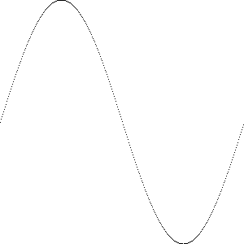

安装 : [liunx下安装](<http://c.biancheng.net/view/3993.html>)


## go语言的特点

1. 引入包的概念，go语言的每一个文件都要属于一个包，不能单独存在

2. 引入垃圾回收机制，内存自动回收

3. 天然并发(支持大并发)

   - 从语言层面支持并发，实现简单
   - 从**goroutine**，轻量级线程，可实现大并发处理，高效利用多核
   - 基于CPS并发模型实现

4. 吸收管道通信机制，**channel**，可以实现不同goroutine的通信

5. go函数可以支持返回多个值

   ```go
   func getSumAndSub(n1 int,n2 int) (int,int){
       sum := n1 + n2 // go语句后面不需要分号
       sub := n1 - n2
       return sum,sub
   }
   ```

6. 增加切片 slice ,延迟执行 defer


编译:`go build hello.go` `./hello`

​         或者 `go run hello.go`


```
go build  -o myhello.exe hello.go
```


编译时，编译器将程序依赖运行的库文件包含在可执行文件中，所以可执行文件可以在没go环境的机器上运行


```
package main

import (
        "fmt"
        "math/rand"
        "time"
)

// 数据生产者
func producer(header string, channel chan<- string) {
     // 无限循环, 不停地生产数据
     for {
            // 将随机数和字符串格式化为字符串发送给通道
            channel <- fmt.Sprintf("%s: %v", header, rand.Int31())
            // 等待1秒
            time.Sleep(time.Second)
        }
}

// 数据消费者
func customer(channel <-chan string) {
     // 不停地获取数据
     for {
            // 从通道中取出数据, 此处会阻塞直到信道中返回数据
            message := <-channel
            // 打印数据
            fmt.Println(message)
        }
}

func main() {
    // 创建一个字符串类型的通道
    channel := make(chan string)
    // 创建producer()函数的并发goroutine
    go producer("cat", channel)
    go producer("dog", channel)
    // 数据消费函数
    customer(channel)
}
/*
对代码的分析：
第03行，导入格式化（fmt）、随机数（math/rand）、时间（time）包参与编译。
第10行，生产数据的函数，传入一个标记类型的字符串及一个只能写入的通道。
第13行，for{}构成一个无限循环。
第15行，使用rand.Int31()生成一个随机数，使用fmt.Sprintf()函数将header和随机数格式化为字符串。
第18行，使用time.Sleep()函数暂停1秒再执行这个函数。如果在goroutine中执行时，暂停不会影响其他goroutine的执行。
第23行，消费数据的函数，传入一个只能写入的通道。
第26行，构造一个不断消费消息的循环。
第28行，从通道中取出数据。
第31行，将取出的数据进行打印。
第35行，程序的入口函数，总是在程序开始时执行。
第37行，实例化一个字符串类型的通道。
第39行和第40行，并发执行一个生产者函数，两行分别创建了这个函数搭配不同参数的两个goroutine。
第42行，执行消费者函数通过通道进行数据消费。

整段代码中，没有线程创建，没有线程池也没有加锁，仅仅通过关键字 go 实现 goroutine，和通道实现数据交换。
*/
```

【实例】HTTP 文件服务器是常见的 Web 服务之一。开发阶段为了测试，需要自行安装 Apache 或 Nginx 服务器，下载安装配置需要大量的时间。使用 Go语言实现一个简单的 HTTP 服务器只需要几行代码，如下所示。

```
package main

import (
    "net/http"
)

func main() {
    http.Handle("/", http.FileServer(http.Dir(".")))
    http.ListenAndServe(":8080", nil)
}

/*
下面是代码说明：
第 1 行，标记当前文件为 main 包，main 包也是 Go 程序的入口包。
第 3~5 行，导入 net/http 包，这个包的作用是 HTTP 的基础封装和访问。
第 7 行，程序执行的入口函数 main()。
第 8 行，使用 http.FileServer 文件服务器将当前目录作为根目录（/目录）的处理器，访问根目录，就会进入当前目录。
第 9 行，默认的 HTTP 服务侦听在本机 8080 端口。
*/
```


## Go语言工程结构简单

Go语言的源码无须头文件，编译的文件都来自于后缀名为`.go`的源码文件。

Go语言无须解决方案、工程文件和 Make File，只要将工程文件按照 `GOPATH` 的规则进行填充，即可使用 go build/go install 进行编译，编译安装的二进制可执行文件统一放在 bin 文件夹下。

后面的章节会介绍 GOPATH 及 go build/go install 的详细使用方法。

`for循环`

```
for a := 0;a<10;a++{
    // 循环代码
}
```

`if判断`

```
if 表达式{
    // 表达式成立
}
```

`自增i++`

在 Go语言中，自增操作符不再是一个操作符，而是一个语句,只有`i++`

| 目录名 | 说明                                                         |
| ------ | ------------------------------------------------------------ |
| api    | 每个版本的 api 变更差异                                      |
| bin    | go 源码包编译出的编译器（go）、文档工具（godoc）、格式化工具（gofmt） |
| blog   | Go 博客的模板，使用 Go 的网页模板，有一定的学习意义          |
| doc    | 英文版的 Go 文档                                             |
| lib    | 引用的一些库文件                                             |
| misc   | 杂项用途的文件，例如 [Android](http://c.biancheng.net/android/) 平台的编译、git 的提交钩子等 |
| pkg    | Windows 平台编译好的中间文件                                 |
| src    | 标准库的源码                                                 |
| test   | 测试用例                                                     |

# 1. GO 语言的基本语法

## 1.1 go语言变量的声明（使用var关键字）

声明变量的一般形式是使用 var 关键字：`var 变量名 变量类型 `

例如 `var a, b *int`

Go语言的基本类型有：

- bool
- string
- int、int8、int16、int32、int64
- uint、uint8、uint16、uint32、uint64、uintptr
- byte // uint8 的别名
- rune // int32 的别名 代表一个 Unicode 码
- float32、float64
- complex64、complex128

当一个变量被声明之后，系统自动赋予它该类型的零值：int 为 0，float 为 0.0，bool 为 false，string 为空字符串，指针为 nil 等。

**所有的内存在 Go 中都是经过初始化的**

变量的命名规则遵循骆驼命名法，即首个单词小写，每个新单词的首字母大写，例如：numShips 和 startDate 。

使用关键字var和括号，可以将一组变量定义放在一起。

```
var (
    a int
    b string
    c []float32
    d func() bool
    e struct {
        x int
    }
)
```

除 var 关键字外，还可使用更加简短的变量定义和初始化语法。

`名字 := 表达式`

需要注意的是，简短模式（short variable declaration）有以下限制：

- 定义变量，同时显式初始化。
- 不能提供数据类型。
- 只能用在函数内部。

和 var 形式声明语句一样，简短变量声明语句也可以用来声明和初始化一组变量：

`i, j := 0, 1`

```
func main() {
   x:=100
   a,s:=1, "abc"
}
```

## 1.2 变量的初始化

标准写法 : `var 变量名 类型 = 表达式`

例如 `var hp int = 100`	

编译器推导类型的格式 ：  `var hp = 100`

默认0.17为高精度 float64


短变量声明并初始化 ：`hp :=100`

  这是 Go 语言的推导声明写法，编译器会自动根据右值类型推断出左值的对应类型。

注意：由于使用了`:=`，而不是赋值的`=`，因此推导声明写法的左值变量必须是没有定义过的变量。若定义过，将会发生编译错误。  

注意：在多个短变量声明和赋值中，至少有一个新声明的变量出现在左值中，即便其他变量名可能是重复声明的，编译器也不会报错，代码如下：

```
conn, err := net.Dial("tcp", "127.0.0.1:8080")
conn2, err := net.Dial("tcp", "127.0.0.1:8080")
```

上面的代码片段，编译器不会报err重复定义。


多重赋值

```
var a int = 100
var b int = 200
b, a = a, b
fmt.Println(a, b)


200 100
```

 多重赋值时，变量的左值和右值按从左到右的顺序赋值。

多重赋值在 Go 语言的错误处理和函数返回值中会大量地使用。  

## 2.3 匿名变量

匿名变量特定是一个下划线"_" ,任何值都可以被赋给他，但是会被抛弃，不会再后续代码中使用该变量

```go
func GetData() (int, int) {
    return 100, 200
}

a, _ := GetData()
_, b := GetData()

fmt.Println(a, b)

代码说明如下：
第 5 行只需要获取第一个返回值，所以将第二个返回值的变量设为下画线。
第 6 行将第一个返回值的变量设为匿名。
```

**匿名变量不占用命名空间，不会分配内存。匿名变量与匿名变量之间也不会因为多次声明而无法使用。**

## 2.4 变量的作用域

  一个变量（常量、类型或函数）在程序中都有一定的作用范围，称之为作用域。如果一个变量在函数体外声明，则被认为是全局变量，可以在整个包甚至外部包（被导出后）使用，不管你声明在哪个源文件里或在哪个源文件里调用该变量。

在函数体内声明的变量称之为局部变量，它们的作用域只在函数体内，参数和返回值变量也是局部变量。在今后的学习中我们将会学习到像 if 和 for 这些控制结构，而在这些结构中声明的变量的作用域只在相应的代码块内。一般情况下，局部变量的作用域可以通过代码块（用大括号括起来的部分）判断。  

不要将作用域和生命周期混为一谈。声明语句的作用域对应的是一个源代码的文本区域；它是一个编译时的属性。一个变量的生命周期是指程序运行时变量存在的有效时间段，在此时间区域内它可以被程序的其他部分引用；是一个运行时的概念。


和 for 循环类似，if 和 switch 语句也会在条件部分创建隐式词法域，还有它们对应的执行体词法域。下面的 if-else 测试链演示了 x 和 y 的有效作用域范围：

```go
if x := f(); x == 0 {
    fmt.Println(x)
} else if y := g(x); x == y {
    fmt.Println(x, y)
} else {
    fmt.Println(x, y)
}
fmt.Println(x, y) // 编译错误: x 和 y 未定义

第二个 if 语句嵌套在第一个内部，因此第一个 if 语句条件初始化词法域声明的变量在第二个 if 中也可以访问。switch 语句的每个分支也有类似的词法域规则：条件部分为一个隐式词法域，然后每个是每个分支的词法域。
```

```go
if f, err := os.Open(fname); err != nil { // 编译错误: unused: f
    return err
}
f.ReadByte() // 编译错误: undefined f
f.Close()    // 编译错误: undefined f
```

【例子 】获取当前的工作目录然后保存到一个包级的变量中。这可以本来通过直接调用 os.Getwd 完成

如果要正确更新包级变量，最好不用 `:=` 

```go
var cwd string

func init() {
    var err error    //通过单独声明 err 变量，来避免使用 := 的简短声明方式：
    cwd, err = os.Getwd()
    if err != nil {
        log.Fatalf("os.Getwd failed: %v", err)
    }
}
```

在二进制传输、读写文件的结构描述时，为了保持文件的结构不会受到不同编译目标平台字节长度的影响，不要使用 int 和 uint。

小数点前面或后面的数字都可能被省略（例如 .707 或 1.）。很小或很大的数最好用科学计数法书写，通过 e 或 E 来指定指数部分：

```
const Avogadro = 6.02214129e23  // 阿伏伽德罗常数
const Planck   = 6.62606957e-34 // 普朗克常数
```

用 Printf 函数的 %g 参数打印浮点数，将采用更紧凑的表示形式打印，并提供足够的精度，但是对应表格的数据，使用 %e（带指数）或 %f 的形式打印可能更合适。所有的这三个打印形式都可以指定打印的宽度和控制打印精度。

内置的 complex 函数用于构建复数，内建的 real 和 imag 函数分别返回复数的实部和虚部：

```go
var x complex128 = complex(1, 2) // 1+2i
var y complex128 = complex(3, 4) // 3+4i
fmt.Println(x*y)                 // "(-5+10i)"
fmt.Println(real(x*y))           // "-5"
fmt.Println(imag(x*y))           // "10"
```

  函数 real(c) 和 imag(c) 可以分别获得相应的实数和虚数部分。

在使用格式化说明符时，可以使用 %v 来表示复数，但当你希望只表示其中的一个部分的时候需要使用 %f。

复数支持和其它数字类型一样的运算。当你使用等号 == 或者不等号 != 对复数进行比较运算时，注意对精确度的把握。cmath 包中包含了一些操作复数的公共方法。如果你对内存的要求不是特别高，最好使用 complex128 作为计算类型，因为相关函数都使用这个类型的参数。  

## 2.5 sin图像

  在 Go 语言中，正弦函数由 math 包提供，函数入口为 math.Sin。正弦函数的参数为 float64，返回值也是 float64。在使用正弦函数时，根据实际精度可以进行转换。

Go 语言的标准库支持对图片像素进行访问，并且支持输出各种图片格式，如 JPEG、PNG、GIF 等。  

```go
package main

import (
    "image"
    "image/color"
    "image/png"
    "log"
    "math"
    "os"
)

func main() {
	
	//  设置图片背景色
	
	
    // 图片大小
    const size = 300
    // 根据给定大小创建灰度图
    pic := image.NewGray(image.Rect(0, 0, size, size))

    // 遍历每个像素
    for x := 0; x < size; x++ {
        for y := 0; y < size; y++ {
            // 填充为白色
            pic.SetGray(x, y, color.Gray{255})
        }
    }
    /*
    代码说明如下：
    第 2 行，声明一个 size 常量，值为 300。
    第 5 行，使用 image 包的 NewGray() 函数创建一个图片对象，使用区域由 image.Rect 结构提供。image.Rect 描述一个方形的两个定位点 (x1,y1) 和 (x2,y2)。image.Rect(0,0,size,size) 表示使用完整灰度图像素，尺寸为宽 300，长 300。
    第 8 行和第 9 行，遍历灰度图的所有像素。
    第 11 行，将每一个像素的灰度设为 255，也就是白色。
    */
    
    //   绘制正弦函数轨迹
    
    
    // 从0到最大像素生成x坐标
    for x := 0; x < size; x++ {

        // 让sin的值的范围在0~2Pi之间
        s := float64(x) * 2 * math.Pi / size

        // sin的幅度为一半的像素。向下偏移一半像素并翻转
        y := size/2 - math.Sin(s)*size/2

        // 用黑色绘制sin轨迹
        pic.SetGray(x, int(y), color.Gray{0})
    }

	//  写入图片文件
	
	
    // 创建文件
    file, err := os.Create("sin.png")

    if err != nil {
        log.Fatal(err)
    }
    // 使用png格式将数据写入文件
    png.Encode(file, pic) //将image信息写入文件中

    // 关闭文件
    file.Close()
    /*
    第 2 行，创建 sin.png 的文件。
    第 4 行，如果创建文件失败，返回错误，打印错误并终止。
    第 8 行，使用 PNG 包，将图形对象写入文件中。
    第 11 行，关闭文件。
    */
}
```




## 2.6 bool 类型

布尔值可以和 &&（AND）和 ||（OR）操作符结合，并且有短路行为：如果运算符左边值已经可以确定整个布尔表达式的值，那么运算符右边的值将不再被求值，因此下面的表达式总是安全的：

`s != "" && s[0] == 'x'`

布尔值并不会隐式转换为数字值 0 或 1，反之亦然。不允许布尔类型强制转换int

``` go
flag:=true
fmt.Println((flag)*1) // 会报错
```


如果需要经常做类似的转换, 包装成一个函数会更方便:

```go
// 如果b为真，btoi返回1；如果为假，btoi返回0
func btoi(b bool) int {
    if b {
        return 1
    }
    return 0
}
```

数字到布尔型的逆转换则非常简单, 不过为了保持对称, 我们也可以包装一个函数:

```go
// itob报告是否为非零。
func itob(i int) bool { return i != 0 }
```


## 2.7 字符串

字符串是一种值类型，且值不可变，即创建某个文本后你无法再次修改这个文本的内容；更深入地讲，字符串是字节的定长数组。

该类字符串使用反引号`` ` 括起来，支持换行，例如：

`This is a raw string \n` 中的 `\n` 会被原样输出。

和 C/C++ 不一样，Go 中的字符串是根据长度限定，而非特殊字符 \0。string 类型的零值为长度为零的字符串，即空字符串 ""。

字符串的内容（纯字节）可以通过标准索引法来获取，在中括号 [] 内写入索引，索引从 0 开始计数：

- 字符串 str 的第 1 个字节：str[0]
- 第 i 个字节：str[i - 1]
- 最后 1 个字节：str[len(str)-1]

需要注意的是，这种转换方案只对纯 ASCII 码的字符串有效。

> 注意：获取字符串中某个字节的地址的行为是非法的，例如：&str[i]。

两个字符串 s1 和 s2 可以通过 s := s1 + s2 拼接在一起。s2 追加在 s1 尾部并生成一个新的字符串 s。

拼接的简写形式 += 也可以用于字符串：

```
s := "hel" + "lo,"
s += "world!"
fmt.Println(s) //输出 “hello, world!”
```

如果需要在源码中嵌入一个多行字符串时，就必须使用```字符，代码如下

```go
const str = ` 第一行
第二行
第三行
\r\n
`
fmt.Println(str)
```

```
第一行
第二行
第三行
\r\n
```

`Go语言计算字符串长度——len()和RuneCountInString()`

```
tip1 := "genji is a ninja"
fmt.Println(len(tip1))

tip2 := "忍者"
fmt.Println(len(tip2))
```

```
16
6
```

len() 函数的返回值的类型为 int，表示字符串的 

ASCII

 字符个数或字节长度。

- 输出中第一行的 16 表示 tip1 的字符个数为 16。
- 输出中第二行的 6 表示 tip2 的字符格式，也就是“忍者”的字符个数是 6，然而根据习惯，“忍者”的字符个数应该是 2。

  这里的差异是由于 Go 语言的字符串都以 UTF-8 格式保存，每个中文占用 3 个字节，因此使用 len() 获得两个中文文字对应的 6 个字节。

如果希望按习惯上的字符个数来计算，就需要使用 Go 语言中 UTF-8 包提供的 RuneCountInString() 函数，统计 Uncode 字符数量。

下面的代码展示如何计算UTF-8的字符个数。  

```
fmt.Println(utf8.RuneCountInString("忍者"))
fmt.Println(utf8.RuneCountInString("龙忍出鞘,fight!"))
```

```
2
11
```

#### 总结

- ASCII 字符串长度使用 len() 函数。
- Unicode 字符串长度使用 `utf8.RuneCountInString() `函数。

`按Unicode字符遍历字符串`

```
theme := "狙击 start"

for _, s := range theme {
    fmt.Printf("Unicode: %c  %d\n", s, s)
}
```

```
Unicode: 狙  29401
Unicode: 击  20987
Unicode:    32
Unicode: s  115
Unicode: t  116
Unicode: a  97
Unicode: r  114
Unicode: t  116
```

#### 总结

- ASCII 字符串遍历直接使用下标。
- Unicode 字符串遍历用 for range。

`Go语言字符串截取（获取字符串的某一段字符）`

```go
tracer := "死神来了, 死神bye bye"
comma := strings.Index(tracer, ", ")

pos := strings.Index(tracer[comma:], "死神")

fmt.Println(comma, pos, tracer[comma+pos:])

代码说明如下：
1) 第 2 行尝试在 tracer 的字符串中搜索中文的逗号，返回的位置存在 comma 变量中，类型是 int，表示从 tracer 字符串开始的 ASCII 码位置。

strings.Index() 函数并没有像其他语言一样，提供一个从某偏移开始搜索的功能。不过我们可以对字符串进行切片操作来实现这个逻辑。

2) 第4行中，tracer[comma:] 从 tracer 的 comma 位置开始到 tracer 字符串的结尾构造一个子字符串，返回给 string.Index() 进行再索引。得到的 pos 是相对于 tracer[comma:] 的结果。

comma 逗号的位置是 12，而 pos 是相对位置，值为 3。我们为了获得第二个“死神”的位置，也就是逗号后面的字符串，就必须让 comma 加上 pos 的相对偏移，计算出 15 的偏移，然后再通过切片 tracer[comma+pos:] 计算出最终的子串，获得最终的结果：“死神bye bye”。
```

```
12 3 死神bye bye
```

#### 总结

字符串索引比较常用的有如下几种方法：

- strings.Index：正向搜索子字符串。
- strings.LastIndex：反向搜索子字符串。
- 搜索的起始位置可以通过切片偏移制作。

`Go语言修改字符串`

Go 语言的字符串无法直接修改每一个字符元素，只能通过重新构造新的字符串并赋值给原来的字符串变量实现。请参考下面的代码：

```go
angel := "Heros never die"

angleBytes := []byte(angel)

for i := 5; i <= 10; i++ {
    angleBytes[i] = ' '
}

fmt.Println(string(angleBytes))

代码说明如下：
在第 3 行中，将字符串转为字符串数组。
第 5～7 行利用循环，将 never 单词替换为空格。
最后打印结果。
```

```
Heros       die
```

  字符串不可变有很多好处，如天生线程安全，大家使用的都是只读对象，无须加锁；再者，方便内存共享，而不必使用写时复制（Copy On Write）等技术；字符串 hash 值也只需要制作一份。

所以说，代码中实际修改的是 []byte，[]byte 在 Go 语言中是可变的，本身就是一个切片。

在完成了对 []byte 操作后，在第 9 行，使用 string() 将 []byte 转为字符串时，重新创造了一个新的字符串。  

#### 总结

- Go 语言的字符串是不可变的。
- 修改字符串时，可以将字符串转换为 []byte 进行修改。
- []byte 和 string 可以通过强制类型转换互转。

`Go语言字符串拼接（连接）`

除了加号连接字符串，Go 语言中也有类似于 StringBuilder 的机制来进行高效的字符串连接，例如：

```go
hammer := "吃我一锤"

sickle := "死吧"

// 声明字节缓冲
var stringBuilder bytes.Buffer

// 把字符串写入缓冲
stringBuilder.WriteString(hammer)
stringBuilder.WriteString(sickle)

// 将缓冲以字符串形式输出
fmt.Println(stringBuilder.String())
```

`  bytes.Buffer` 是可以缓冲并可以往里面写入各种字节数组的。字符串也是一种字节数组，使用 `WriteString() `方法进行写入。

将需要连接的字符串，通过调用 `WriteString() `方法，写入` stringBuilder` 中，然后再通过 `stringBuilder.String()` 方法将缓冲转换为字符串。  

**Go语言fmt.Sprintf（格式化输出）**

`fmt.Sprintf(格式化样式, 参数列表…)`

- 格式化样式：字符串形式，格式化动词以`%`开头。
- 参数列表：多个参数以逗号分隔，个数必须与格式化样式中的个数一一对应，否则运行时会报错。

```
var progress = 2
var target = 8

// 两参数格式化
title := fmt.Sprintf("已采集%d个药草, 还需要%d个完成任务", progress, target)

fmt.Println(title)

pi := 3.14159
// 按数值本身的格式输出
variant := fmt.Sprintf("%v %v %v", "月球基地", pi, true)

fmt.Println(variant)

// 匿名结构体声明, 并赋予初值
profile := &struct {
    Name string
    HP   int
}{
    Name: "rat",
    HP:   150,
}

fmt.Printf("使用'%%+v' %+v\n", profile)

fmt.Printf("使用'%%#v' %#v\n", profile)

fmt.Printf("使用'%%T' %T\n", profile)
```

```
已采集2个药草, 还需要8个完成任务
"月球基地" 3.14159 true
使用'%+v' &{Name:rat HP:150}
使用'%#v' &struct { Name string; HP int }{Name:"rat", HP:150}
使用'%T' *struct { Name string; HP int }
```

| 动  词 | 功  能                                   |
| ------ | ---------------------------------------- |
| %v     | 按值的本来值输出                         |
| %+v    | 在 %v 基础上，对结构体字段名和值进行展开 |
| %#v    | 输出 Go 语言语法格式的类型和值           |
| %T     | 输出 Go 语言语法格式的类型               |
| %%     | 输出 % 本体                              |
| %b     | 整型以二进制方式显示                     |
| %o     | 整型以八进制方式显示                     |
| %d     | 整型以十进制方式显示                     |
| %x     | 整型以十六进制方式显示                   |
| %X     | 整型以十六进制、字母大写方式显示         |
| %U     | Unicode 字符                             |
| %f     | 浮点数                                   |
| %p     | 指针，十六进制方式显示                   |

**Go语言Base64编码——电子邮件的基础编码格式**

  Base64 编码是常见的对 8 比特字节码的编码方式之一。Base64 可以使用 64 个可打印字符来表示二进制数据，电子邮件就是使用这种编码。

Go 语言的标准库自带了 Base64 编码算法，通过几行代码就可以对数据进行编码，示例代码如下。  

```
package main

import (
    "encoding/base64"
    "fmt"
)

func main() {

    // 需要处理的字符串
    message := "Away from keyboard. https://golang.org/"

    // 编码消息
    encodedMessage := base64.StdEncoding.EncodeToString([]byte (message))

    // 输出编码完成的消息
    fmt.Println(encodedMessage)

    // 解码消息
    data, err := base64.StdEncoding.DecodeString(encodedMessage)

    // 出错处理
    if err != nil {
        fmt.Println(err)
    } else {
        // 打印解码完成的数据
        fmt.Println(string(data))
    }
}

代码说明如下：
第 11 行为需要编码的消息，消息可以是字符串，也可以是二进制数据。
第 14 行，base64 包有多种编码方法，这里使用 base64.StdEnoding 的标准编码方法进行编码。传入的字符串需要转换为字节数组才能供这个函数使用。
第 17 行，编码完成后一定会输出字符串类型，打印输出。
第 20 行，解码时可能会发生错误，使用 err 变量接收错误。
第 24 行，出错时，打印错误。
第 27 行，正确时，将返回的字节数组（[]byte）转换为字符串。
```

## 2.8 Go语言字符类型（byte和rune）

Go语言的字符有以下两种：

- 一种是 uint8 类型，或者叫 byte 型，代表了 [ASCII](http://c.biancheng.net/c/ascii/) 码的一个字符。
- 另一种是 rune 类型，代表一个 UTF-8 字符。当需要处理中文、日文或者其他复合字符时，则需要用到 rune 类型。rune 类型实际是一个 int32。

因为 Unicode 至少占用 2 个字节，所以我们使用 int16 或者 int 类型来表示。如果需要使用到 4 字节，则会加上 \U 前缀；前缀 \u 则总是紧跟着长度为 4 的 16 进制数，前缀 \U 紧跟着长度为 8 的 16 进制数。

```go
var ch int = '\u0041'
var ch2 int = '\u03B2'
var ch3 int = '\U00101234'
fmt.Printf("%d - %d - %d\n", ch, ch2, ch3) // integer
fmt.Printf("%c - %c - %c\n", ch, ch2, ch3) // character
fmt.Printf("%X - %X - %X\n", ch, ch2, ch3) // UTF-8 bytes
fmt.Printf("%U - %U - %U", ch, ch2, ch3)   // UTF-8 code point
```

```
65 - 946 - 1053236
A - β - r
41 - 3B2 - 101234
U+0041 - U+03B2 - U+101234
```

格式化说明符 %c 用于表示字符；当和字符配合使用时，%v 或 %d 会输出用于表示该字符的整数；%U 输出格式为 U+hhhh 的字符串。

包 unicode 包含了一些针对测试字符的非常有用的函数（其中 ch 代表字符）：

- 判断是否为字母：unicode.IsLetter(ch)
- 判断是否为数字：unicode.IsDigit(ch)
- 判断是否为空白符号：unicode.IsSpace(ch)

这些函数返回一个布尔值。包 utf8 拥有更多与 rune 相关的函数。

## 2.9 Go语言数据类型转换

在必要以及可行的情况下，一个类型的值可以被转换成另一种类型的值。由于 [Go语言](http://c.biancheng.net/golang/)不存在隐式类型转换，因此所有的转换都必须显式说明，就像调用一个函数一样（类型在这里的作用可以看作是一种函数）：

类型 B 的值 = 类型 B(类型 A 的值)

当从一个取值范围较大的转换到取值范围较小的类型时（例如将 int32 转换为 int16 或将 float32 转换为 int），会发生精度丢失（截断）的情况。

## 2.10 Go语言指针详解

指针（pointer）概念在 Go 语言中被拆分为两个核心概念：

- 类型指针，允许对这个指针类型的数据进行修改。传递数据使用指针，而无须拷贝数据。类型指针不能进行偏移和运算。
- 切片，由指向起始元素的原始指针、元素数量和容量组成。

  受益于这样的约束和拆分，Go 语言的指针类型变量拥有指针的高效访问，但又不会发生指针偏移，从而避免非法修改关键性数据问题。同时，垃圾回收也比较容易对不会发生偏移的指针进行检索和回收。

切片比原始指针具备更强大的特性，更为安全。切片发生越界时，运行时会报出宕机，并打出堆栈，而原始指针只会崩溃。  


**认识指针地址和指针类型**

  一个指针变量可以指向任何一个值的内存地址它指向那个值的内存地址，在 32 位机器上占用 4 个字节，在 64 位机器上占用 8 个字节，并且与它所指向的值的大小无关。当然，可以声明指针指向任何类型的值来表明它的原始性或结构性；你可以在指针类型前面加上 * 号（前缀）来获取指针所指向的内容，这里的 * 号是一个类型更改器。使用一个指针引用一个值被称为间接引用。

当一个指针被定义后没有分配到任何变量时，它的值为 nil。一个指针变量通常缩写为 ptr。

每个变量在运行时都拥有一个地址，这个地址代表变量在内存中的位置。Go 语言中使用`&`作符放在变量前面对变量进行“取地址”操作。  

`ptr := &v    // v的类型为T`

其中 v 代表被取地址的变量，被取地址的 v 使用 ptr 变量进行接收，ptr 的类型就为`*T`，称做 T 的指针类型。`*`代表指针。

```go
package main

import (
    "fmt"
)

func main() {
    var cat int = 1
    var str string = "banana"
    fmt.Printf("%p %p", &cat, &str)
}

代码说明如下：
第 8 行，声明整型 cat 变量。
第 9 行，声明字符串 str 变量。
第 10 行，使用 fmt.Printf 的动词%p输出 cat 和 str 变量取地址后的指针值，指针值带有0x的十六进制前缀。
```

```
0xc042052088 0xc0420461b0
```

对指针使用`*`操作，也就是指针取值

```go

package main

import (
    "fmt"
)

func main() {

    // 准备一个字符串类型
    var house = "Malibu Point 10880, 90265"

    // 对字符串取地址, ptr类型为*string
    ptr := &house

    // 打印ptr的类型
    fmt.Printf("ptr type: %T\n", ptr)

    // 打印ptr的指针地址
    fmt.Printf("address: %p\n", ptr)

    // 对指针进行取值操作
    value := *ptr

    // 取值后的类型
    fmt.Printf("value type: %T\n", value)

    // 指针取值后就是指向变量的值
    fmt.Printf("value: %s\n", value)

}
/*
代码说明如下：
第 10 行，准备一个字符串并赋值。
第 13 行，对字符串取地址，将指针保存到 ptr 中。
第 16 行，打印 ptr 变量的类型，类型为 *string。
第 19 行，打印 ptr 的指针地址，每次运行都会发生变化。
第 22 行，对 ptr 指针变量进行取值操作，value 变量类型为 string。
第 25 行，打印取值后 value 的类型。
第 28 行，打印 value 的值。
*/
```

```
ptr type: *string
address: 0xc0420401b0
value type: string
value: Malibu Point 10880, 90265
```

变量、指针地址、指针变量、取地址、取值的相互关系和特性如下：

- 对变量进行取地址（&）操作，可以获得这个变量的指针变量。
- 指针变量的值是指针地址。
- 对指针变量进行取值（*）操作，可以获得指针变量指向的原变量的值。

**示例：使用指针变量获取命令行的输入信息**

Go 语言的 flag 包中，定义的指令以指针类型返回。通过学习 flag 包，可以深入了解指针变量在设计上的方便之处。

```go
package main

// 导入系统包
import (
    "flag"
    "fmt"
)

// 定义命令行参数
var mode = flag.String("mode", "", "process mode")

func main() {

    // 解析命令行参数
    flag.Parse()

    // 输出命令行参数
    fmt.Println(*mode)
}

代码说明如下：
第 10 行，通过 flag.String，定义一个 mode 变量，这个变量的类型是 *string。后面 3 个参数分别如下：
参数名称：在给应用输入参数时，使用这个名称。
参数值的默认值：与 flag 所使用的函数创建变量类型对应，String 对应字符串、Int 对应整型、Bool 对应布尔型等。
参数说明：使用 -help 时，会出现在说明中。
第 15 行，解析命令行参数，并将结果写入创建的指令变量中，这个例子中就是 mode 变量。
第 18 行，打印 mode 指针所指向的变量。
```

将这段代码命名为main.go，然后使用如下命令行运行：

`$ go run flagparse.go --mode=fast`

输出   `fast`

由于之前使用 flag.String 已经注册了一个 mode 的命令行参数，flag 底层知道怎么解析命令行，并且将值赋给 mode*string 指针。在 Parse 调用完毕后，无须从 flag 获取值，而是通过自己注册的 mode 这个指针，获取到最终的值。代码运行流程如下图所示。


**创建指针的另一种方法——new() 函数**

```
str := new(string)
*str = "ninja"

fmt.Println(*str)
```

new() 函数可以创建一个对应类型的指针，创建过程会分配内存。被创建的指针指向的值为默认值。

## 2.11 Go语言变量逃逸分析

Go 语言将这个过程整合到编译器中，命名为“变量逃逸分析”。这个技术由编译器分析代码的特征和代码生命期，决定应该如何堆还是栈进行内存分配，即使程序员使用 Go 语言完成了整个工程后也不会感受到这个过程。

#### 1) 逃逸分析

使用下面的代码来展现 Go 语言如何通过命令行分析变量逃逸，代码如下：

```go
package main

import "fmt"

// 本函数测试入口参数和返回值情况
func dummy(b int) int {

    // 声明一个c赋值进入参数并返回
    var c int
    c = b

    return c
}

// 空函数, 什么也不做
func void() {

}

func main() {

    // 声明a变量并打印
    var a int

    // 调用void()函数
    void()

    // 打印a变量的值和dummy()函数返回
    fmt.Println(a, dummy(0))
}
/*
第 6 行，dummy() 函数拥有一个参数，返回一个整型值，测试函数参数和返回值分析情况。
第 9 行，声明 c 变量，这里演示函数临时变量通过函数返回值返回后的情况。
第 16 行，这是一个空函数，测试没有任何参数函数的分析情况。
第 23 行，在 main() 中声明 a 变量，测试 main() 中变量的分析情况。
第 26 行，调用 void() 函数，没有返回值，测试 void() 调用后的分析情况。
第 29 行，打印 a 和 dummy(0) 的返回值，测试函数返回值没有变量接收时的分析情况。
*/
```

接着使用如下命令行运行上面的代码：

`$ go run -gcflags "-m -l" main.go`

使用 go run 运行程序时，`-gcflags` 参数是编译参数。其中 -m 表示进行内存分配分析，-l 表示避免程序内联，也就是避免进行程序优化。

```
# command-line-arguments
./main.go:29:13: a escapes to heap
./main.go:29:22: dummy(0) escapes to heap
./main.go:29:13: main ... argument does not escape
0 0

输出第 2 行告知“main 的第 29 行的变量 a 逃逸到堆”。
第 3 行告知“dummy(0)调用逃逸到堆”。由于 dummy() 函数会返回一个整型值，这个值被 fmt.Println 使用后还是会在其声明后继续在 main() 函数中存在。
第 4 行，这句提示是默认的，可以忽略。
```

#### 2) 取地址发生逃逸

下面的例子使用结构体做数据，了解在堆上分配的情况，代码如下：

```go
package main

import "fmt"

// 声明空结构体测试结构体逃逸情况
type Data struct {
}

func dummy() *Data {

    // 实例化c为Data类型
    var c Data

    //返回函数局部变量地址
    return &c
}

func main() {

    fmt.Println(dummy())
}
/*
代码说明如下：
第 6 行，声明一个空的结构体做结构体逃逸分析。
第 9 行，将 dummy() 函数的返回值修改为 *Data 指针类型。
第 12 行，将 c 变量声明为 Data 类型，此时 c 的结构体为值类型。
第 15 行，取函数局部变量 c 的地址并返回。Go 语言的特性允许这样做。
第 20 行，打印 dummy() 函数的返回值。
*/
```

```
$ go run -gcflags "-m -l" main.go
# command-line-arguments
./main.go:15:9: &c escapes to heap
./main.go:12:6: moved to heap: c
./main.go:20:19: dummy() escapes to heap
./main.go:20:13: main ... argument does not escape
&{}
```

  注意第 4 行出现了新的提示：将 c 移到堆中。这句话表示，Go 编译器已经确认如果将 c 变量分配在栈上是无法保证程序最终结果的。如果坚持这样做，dummy() 的返回值将是 Data 结构的一个不可预知的内存地址。这种情况一般是 C/C++ 语言中容易犯错的地方：引用了一个函数局部变量的地址。

Go 语言最终选择将 c 的 Data 结构分配在堆上。然后由垃圾回收器去回收 c 的内存。  

编译器觉得变量应该分配在堆和栈上的原则是：

- 变量是否被取地址。
- 变量是否发生逃逸。

