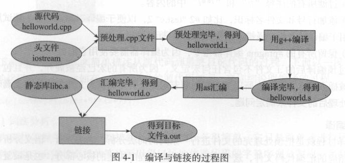
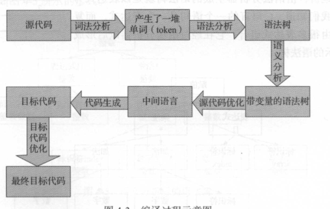
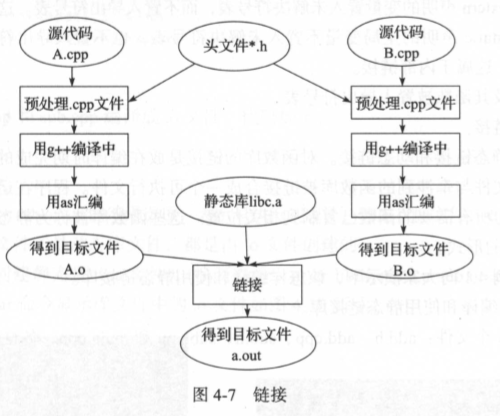
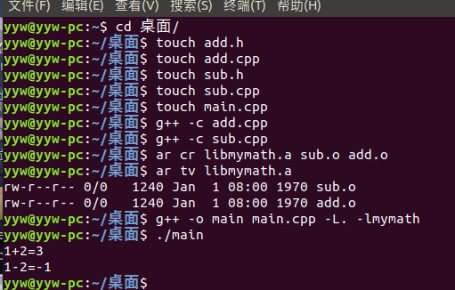
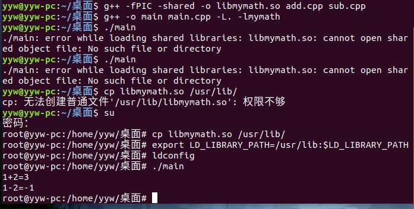

## 第4章 编译

编译与连接分为四个步骤 ：

 

1. 预处理 （g++ -E hello.cpp  -o  hello.i   ） -E 表示只进行预处理  经过预处理以后，不包含任何宏或头文件，都被展开了 

   2. 编译  (g++ -S hello.i  -o  hello.s )  源代码到汇编代码的转化

      

   3. 汇编 

   4. 连接 主要包括地址和空间分配，符号决议和重定位步骤

链接分为静态链接和动态链接

对函数库的链接是在编译时完成的是静态链接

-c  的编译选项表示只执行到编译

`ar cr libmymath.a sub.o  add.o` 创建静态库 ，库文件以lib开头

`ar tv`可以查看库文件有哪些目标文件

`g++ -o main main.cpp -L. -lmymath`    使用静态库生成main文件

动态库

`g++ -fPIC -shared -o libmymath.so add.cpp sub.cpp` 生成动态库文件

-fPIC 表示编译为位置独立的代码

执行`g++ -o main main.cpp -L. -lmymath` 不过会报错，提示暂时找不到动态库

动态库路径搜索顺序

- 编译目标代码时指定的动态库搜索路径
- 环境变量LD_LIBRARY_PATH 指定的动态库搜索路径
- 配置文件/etc/ld.so.conf中指定的动态库搜索路径，只需要在该文件中追加一行库所在的完整路径即可如"/root/test/conf/lib"
- 默认的动态库搜索路径/lib
- 默认的动态库搜索路径/usr/lib

所以解决办法

1. 将文件libmymath.so复制到目录/usr/lib中 

   `cp libmymath.so /usr/lib`

2. 修改环境变量LD_LIBRARY_PATH

   `export LD_LIBRARY_PATH=/usr/lib:$LD_LIBRARY_PATH`

   `sudo ldconfig`           ldconfig使修改生效

**先找动态库，再找静态库**

1. 动态库有利于进程间资源共享

   程序运行时要调用某个动态链接库函数时，操作系统会先查看所有正在运行的程序，看内存中是否有此库函数的拷贝，若有，则共享那一个拷贝，没有才链接载入，节省系统内存空间

2. 将程序升级变得简单

   使用静态库，库发生变化，使用该库的程序要重新编译，使用动态库，只要动态库提供给该程序的接口没变，只要重新用新生成的动态库替换原来的动态库即可

3. 做到链接载入由程序员在程序代码中控制

   函数可以有需求再调入

4. 静态库在编译时将库函数装载到程序中，动态库在运行时装载，程序执行时，静态库更快

**g++和gcc的区别**

1. 后缀为`.c`的文件gcc当做C程序， g++当做C++程序
2. 编译可以用 gcc/g++,链接可以用g++或gcc-lstdc++,因为gcc命令不能自动和c++程序使用的库链接
3. 