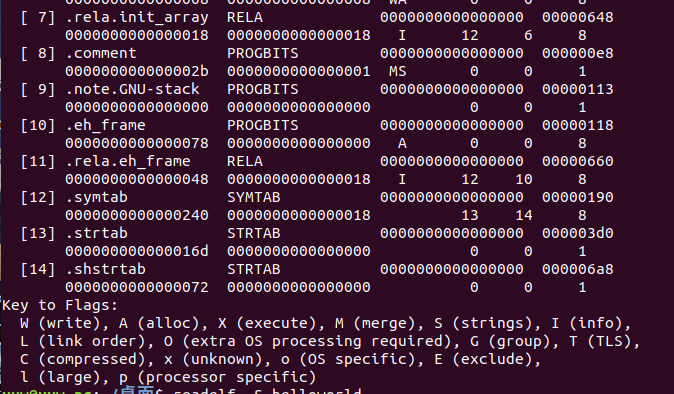

## 第4章 编译

编译与连接分为四个步骤 ：

 

1. 预处理 （g++ -E hello.cpp  -o  hello.i   ） -E 表示只进行预处理  经过预处理以后，不包含任何宏或头文件，都被展开了 

   2. 编译  (g++ -S hello.i  -o  hello.s )  源代码到汇编代码的转化

      

   3. 汇编 

   4. 连接 主要包括地址和空间分配，符号决议和重定位步骤


链接分为静态链接和动态链接

对函数库的链接是在编译时完成的是静态链接

-c  的编译选项表示只执行到编译

`ar cr libmymath.a sub.o  add.o` 创建静态库 ，库文件以lib开头

`ar tv`可以查看库文件有哪些目标文件

`g++ -o main main.cpp -L. -lmymath`    使用静态库生成main文件


动态库

`g++ -fPIC -shared -o libmymath.so add.cpp sub.cpp` 生成动态库文件

-fPIC 表示编译为位置独立的代码

执行`g++ -o main main.cpp -L. -lmymath` 不过会报错，提示暂时找不到动态库

动态库路径搜索顺序

- 编译目标代码时指定的动态库搜索路径
- 环境变量LD_LIBRARY_PATH 指定的动态库搜索路径
- 配置文件/etc/ld.so.conf中指定的动态库搜索路径，只需要在该文件中追加一行库所在的完整路径即可如"/root/test/conf/lib"
- 默认的动态库搜索路径/lib
- 默认的动态库搜索路径/usr/lib

所以解决办法

1. 将文件libmymath.so复制到目录/usr/lib中 

   `cp libmymath.so /usr/lib`

2. 修改环境变量LD_LIBRARY_PATH

   `export LD_LIBRARY_PATH=/usr/lib:$LD_LIBRARY_PATH`

   `sudo ldconfig`           ldconfig使修改生效


**先找动态库，再找静态库**

1. 动态库有利于进程间资源共享

   程序运行时要调用某个动态链接库函数时，操作系统会先查看所有正在运行的程序，看内存中是否有此库函数的拷贝，若有，则共享那一个拷贝，没有才链接载入，节省系统内存空间

2. 将程序升级变得简单

   使用静态库，库发生变化，使用该库的程序要重新编译，使用动态库，只要动态库提供给该程序的接口没变，只要重新用新生成的动态库替换原来的动态库即可

3. 做到链接载入由程序员在程序代码中控制

   函数可以有需求再调入

4. 静态库在编译时将库函数装载到程序中，动态库在运行时装载，程序执行时，静态库更快

**g++和gcc的区别**

1. 后缀为`.c`的文件gcc当做C程序， g++当做C++程序
2. 编译可以用 gcc/g++,链接可以用g++或gcc-lstdc++,因为gcc命令不能自动和c++程序使用的库链接

### makefile的编写

makefile定义一系列规则，指定哪些文件需要先编译，哪些文件需要后编译，哪些文件需要重新编译等，一个工程的编译规则

`file1.h`

```c++
#ifndef FILE1_H_
#define FILE1_H_
#ifdef __cplusplus
	extern "C" {
        #endif
        void File1Print();
        #ifdef __cplusplus
    }
    #endif
#endif
```

`file1.cpp`

```c++
#include<iostream>
#include "file1.h"
using namespace std;
void File1Print()
{
    cout<<"Print file1******"<<endl;
}
```

`file2.cpp`

```c++
#include <iostream>
#include "file1.h"
using namespace std;
int main()
{
    cout<<"Print file2 "<<endl;
    File1Print();
    return 0;
}
```

`makefile`

```makefile
helloword:file1.o file2.o
	g++ file1.o file2.o -o helloworld

file2.o:file2.cpp
	g++ -c file2.cpp -o file2.o

file1.o:file1.cpp
	g++ -c file1.cpp -o file1.o

clean:
	rm -rf *.o helloworld

```


```makefile
// 使用变量
XX = g++
CFLAGS = -Wall -O -g   // -O 表示编译时优化 -Wall 输出所有警告  -g 编译debug版本
OBJS = file1.o file2.o

helloworld : $(OBJS)
	$(XX) $(OBJS) -o helloworld
```

```makefile
	
//使用函数
CC = gcc
XX = g++
CFLAGS = -Wall -O -g 
// SOURCES = $(wildcard *.c *.cpp)
wildcard 展开为已经存在的，使用空格分开的 匹配此模式的所有文件列表 ，然后存入SOURCES

// OBJS = $(patsubst %.c,%.o,$(patsubst %.cpp %.o,$(SOURCES)))
patsubst 用于匹配替换， 三个参数  1. 匹配样式 2. 用什么替换 3. 需要被处理的列表
这一句的意思是将SOURCES中所有.c和 .cpp文件 换成.o文件

%.o : %.c 
	$(CC) $(CFLAGS) -c $< -o $@
%.o : %.cpp 
	$(XX) $(CFLAGS) -c $< -o $@
	
// $<  扩展成依赖列表中第一个依赖文件
// $@  拓展成当前规则的目的文件名
// $^  拓展成整个依赖的列表
```

### 目标文件

ELF是一种用于二进制文件，可执行文件，目标代码，共享库和核心转储的标准文件格式

DLF标准的目的是提供一组二进制接口定义，这些接口可以延伸到多操作系统中，从而减少重新编码，编译程序的需要

目标文件有三种类型

- 可重定位的目标文件 (.o)

- 可执行的目标文件 

- 可被共享的目标文件 (.so  )

  动态库发挥作用的步骤 

   	1. 链接器拿它和其他.o文件或 .so文件 作为输入，经链接，生成另外的.so文件或可执行文件
   	2. 在运行时，动态链接器拿它和可执行文件以及别的.so文件一起处理，在linux中创建一个进程映象

左: 可重定位文件格式

右: 可执行文件或可被共享的对象文件的格式


我们可以通过file命令查看文件属于那种ELF文件


通过`readelf -h 文件` 可以查看文件头信息


重定位文件不会有 程序入口点地址，程序入口点是程序真正执行起来时，第一条要运行的指令的地址。重定位文件只是供再链接而已

file1.o 有 15个节头(section) ，没有 program headers

`section`是ELF文件中，用来装载内容数据的最小容器

通过`readelf -S 文件` 查看文件section表

 	1. text section 装载可执行代码
 	2. data  section 装载被初始化数据
 	3. bss section 装载未被初始化数据
 	4. .rec 打头的section装载重定位条目
 	5. symtab 或 dynsym section 装载符号信息
 	6. strtab 或 dynstr section 装载字符串信息
 	7. 其他section 如 满足调试目的， 满足动态链接与加载目的




暂略。。。。


## 第五章 调试

