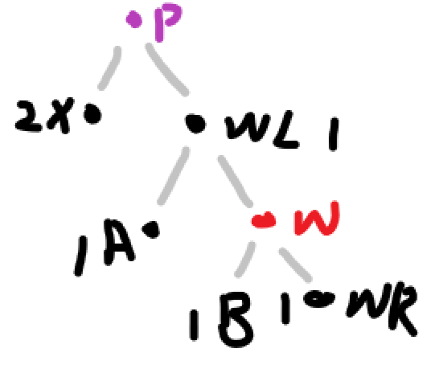

红黑树 : 平衡的二叉查找树 ，时间复杂度o(log(n))，任何插入或删除能在三次旋转以内平衡

### 特性 :

1. 节点是红色或者黑色
2. 根节点是黑色
3. 每个叶子的节点都是黑色的空点节点
4. 每个红色节点的两个子节点都是黑色
5. 从任意节点到其每个叶子的所有路径都包含相同的黑色节点

因为这些规则才能保证红黑树的自平衡，最长路径不超过最短路径的2倍

红黑树是通过旋转来保证在添加或删除元素后依旧能维持红黑树性质的。

旋转 ： 左旋 x 和右旋 y 

LEFT-ROTATE为左旋的代码，选择左旋的节点x，他的右儿子节点 y ，变为 x 的父亲节点，而 y 的左儿子节点 b ，变为 x 的 的右儿子节点

### 插入

将节点z插入(调用 RB_INSERT )到树T内，然后将z着为红色(为了先维护第5条性质)，然后再调用RB_INSERT_FIXUP对节点重新着色并旋转以保持红黑性质

RB-INSERT为插入节点函数，每次和节点值比较，大的在左树，小的在右树，直到到nil节点(没有值)，将其标记为红在插入两个nil节点

RB-INSERT-FIXUP函数是让新增节点的父亲节点也为红色时，调整树使其平衡

 ( 新增的节点在根节点的左侧，右侧则镜像对称)一共三种情况

显然只有新增节点的父节点也是红色才会引发冲突

- **情况一 ：父亲的兄弟是红色**

  

  操作： 把爷爷变红，父亲和父亲的兄弟变黑，那么爷爷相当于新的新增节点向上传递(因此爷爷的父亲也可能为红)，如果一直上一层为红，那么根节点就会变红，我们最后需要将根节点设置为黑

  

- **情况二  ：父亲兄弟为黑且新增节点是父亲的左儿子**

  

操作 ： 

1. 爷爷变红，父亲变黑  

2. 爷爷右旋

- **情况三 ：父亲兄弟为黑且是父亲右儿子**

操作 ： 1. 将父亲节点左旋 ,将原本的新增节点z的父亲当做新增节点

2. 那么就和原本的情况二相同，再按情况二进行操作即可

### 删除

删除节点的时间为o(lg(n)) ,调入参数为 T (红黑树)，u(要删除节点), v (代替删除节点的节点)

RB-TRANSPLANT函数，让v节点代替要删除的u节点

TREE-MINIMUM是找到以当前节点为根节点的树的最小值节点

RB-DELETE函数 删除该节点 (z) ，选择右儿子树中的最小值节点 (y) 作为替代，可以做到右边都比他大，左边都比他小

如果作为代替的那个节点（ y ）是黑色则违反第五条规则(从任意节点到其每个叶子的所有路径都包含相同的黑色节点)，需要再次进行平衡(RB-DELETE-FIXUP)

RB-DELETE-FIXUP传的是代替节点的右儿子 ( x ) (这边有两种情况  1.  z 与 y 直接相连，2 . z 与 y 不直接相连),如果被删除节点只有左树或者右树，那么传入的是被删除节点的左儿子或右儿子，而

最后总体的情况就两种 1. x在右儿子 2. x在左儿子  (因为y和x只有都是黑的才可能导致不平衡，x所在的黑高降低1)

RB-DELETE_FIXUP函数，在删除节点z时，代替z的y节点是黑色且，代替y节点的x节点也是黑色，那么黑高就不平衡，x应为其本身的黑高+1，为使黑高平衡

因为x所在黑高降低1，所以我们将其视为默认+1的黑高，且x必定为黑(因为x为红黑高就不会失衡)，那么x视为黑高+2，我们将x视为黑高+2时整棵树是平衡的

 代替的y节点的x节点在左侧 时一共四种情况，显然代替的y节点的x节点在右侧时也有四种情况，他们是镜像对称的，镜像操作就是将 right 和 left 调换即可

显然只有y为黑，x的颜色才有意义(y为红，整棵树肯定平衡)，且只有x为黑时才会导致不平衡

 **代替的y节点的x节点在左侧 时一共四种情况：**

- **情况一 ： x的兄弟节点w为红**

  因为w为红，那么w的父亲节点p为黑

  旁边的数字代表黑高，显然wl和wr后面还有节点，不然黑高就不平衡了，不过我没画出来

  

  操作： 1. 将w颜色变为黑，将p的颜色变为红( 这时x的黑高和原图相比少1 )

  

  

  2. 将p点左旋 ( 这时黑高和原图都相同 )
     
  3. 这时情况一变为情况二，情况三，情况四中的一种( 这时 原图中的wl视为 w)

- **情况二 ：x的兄弟节点w为黑，且w的左儿子为黑，w的右儿子也为黑**
  因为w为黑，这样我们就没法判断p的颜色了

  

  操作 ：1. 将w变为红色，那么此时p下面的黑高都正好少1，我们将p视为新的x赋予其黑高加1的属性，此时和原图的黑高是一样的

  

  2. 此时p如果为红色，那么将p变为黑色就可以使树平衡，如果p为黑色，那么就又变回情况一，情况二，情况三，情况四了，所以函数最外面需要while循环， 直到x到根节点为止，如果x为根节点且为黑，那么就无所谓了，相当于整棵树的黑高降低1

- **情况三 ： x的兄弟节点w为黑，且w的左儿子为红，w的右儿子为黑**

  

  操作: 1. 将w的颜色变为红，将wl的颜色变为黑,此时黑高和原图不同

  

  2. 将w右旋，此时黑高和原图一样

  

  3. 此时将wl视为新的w，那么此时该情况变成了情况四

- **情况四： x的兄弟节点w是黑色，且w的左儿子是黑，w的右儿子是红**

  

  操作 1.  将 w 和 p 的颜色交换且将wr的颜色变为黑,此时和原图黑高不相同

  

  2. 将节点p左旋,再取消掉x的+1属性，我们可以发现整棵树的黑高平衡了，那就完成了我们平衡整棵树的目标

  

