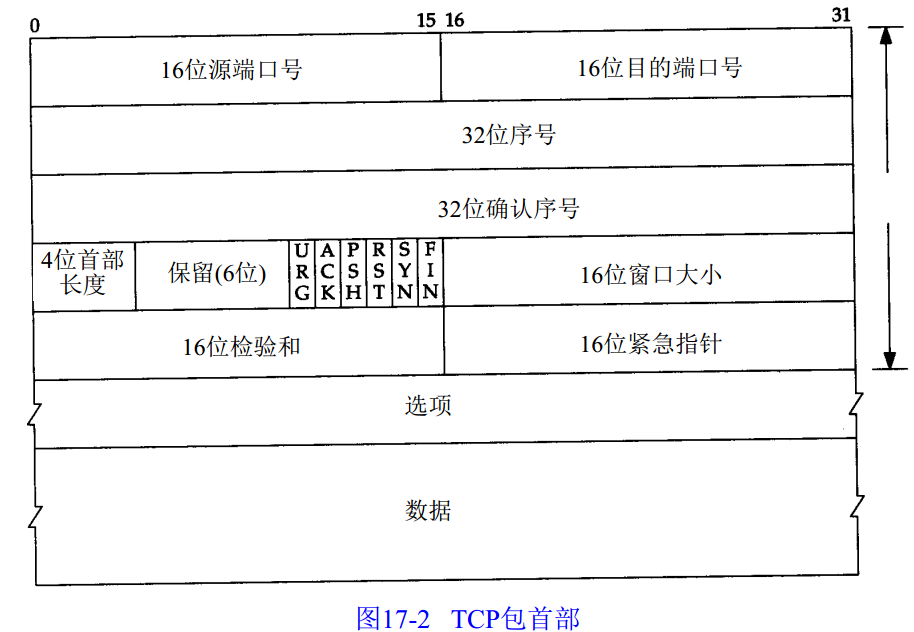

## 腾讯面经总结

下面是腾讯的面经总结

## 数据结构和算法 

1. 一个数怎么判断是不是 2 的幂次？具体实现？

   答：`n&(n-1)`

2. 两个链表某节点开始重合，求第一次重合的位置

   答：先求长度，然后跳

3. 讲一下快排,有几大排序；堆排序的复杂度；底层实现；归并排序的复杂度；快速排序；  它们的稳定性；需不需要打乱？

4. 两个栈实现一个队列

   答：直接实现。

5. 红黑树的特性

6. 常见的排序算法和复杂度

7. 数组找第 k 大的数

   答：①排序②优先队列③partition

8. 非递归二分查找

9. 链表相加


## C++

1. 简单说说多态

   答：静态多态：函数重载

   ​	运行时多态：虚函数

   ​	指向基类的指针在操作它的多态类对象时，会根据不同的类对象调用相应对象的函数，这个函数就是虚函数.

   ​	虚函数表保存了虚函数的地址，用父类指针操作一个子类的时候，指向实际调用的函数。

2. c 语言的 strcpy 函数有什么弊端？怎么用一句代码判断是否发生内存重叠？有看过它的源码吗？出了内存重叠还有什么弊端？

   答：

   **strcpy**:拷贝

   ```cpp
   char* strcpy(char* des, const char* src)
   {
   	assert((des!=NULL) && (src!=NULL)); 
   	char *address = des;  
   	while((*des++ = *src++) != '\0')  
   		;  
   	return address;
   }
   ```

   要知道 strcpy 会拷贝’\0’，还有要注意：

   - 源指针所指的字符串内容是不能修改的，因此应该声明为 const 类型。
   - 要判断源指针和目的指针为空的情况，思维要严谨，这里使用`assert`（见文末）。
   - 要用一个临时变量保存目的串的首地址，最后返回这个首地址。
   - 函数返回 char* 的目的是为了支持链式表达式，即strcpy可以作为其他函数的实参。

   **strlen**:

   ```cpp
   int strlen(const char* str)
   {
   	assert(str != NULL);
   	int len = 0;
   	while((*str++) != '\0')
   		++len;
   	return len;
   }
   ```

   strlen 与 sizeof 的区别：

   - sizeof是运算符，strlen是库函数。
   - sizeof可以用类型、变量做参数，而strlen只能用 char* 变量做参数，且必须以`\0`结尾。
   - sizeof是在编译的时候计算类型或变量所占内存的大小，而strlen的结果要在运行的时候才能计算出来，用来计算字符串的长度。
   - 数组做sizeof的参数不退化，传递给strlen就退化为指针了。

   **strcat**(字符串连接)

   函数`strcat`的原型是`char* strcat(char* des, char* src)`，des 和 src 所指内存区域不可以重叠且 des 必须有足够的空间来容纳 src 的字符串。

   ```cpp
   char* strcat(char* des, const char* src)   // const表明为输入参数 
   {  
   	assert((des!=NULL) && (src!=NULL));
   	char* address = des;
   	while(*des != '\0')  // 移动到字符串末尾
   		++des;
   	while(*des++ = *src++)
   		;
   	return address;
   }
   ```

3.  静态区 常量区 代码区

   答：程序在内存中的分布：①代码区②静态数据区③未初始化数据区（未初始化全局变量和未初始化static）④堆和栈(2 || 8M)

4. new 和 malloc的区别

   1. new 在自由存储区(堆或特殊内存) malloc 一定在堆里

   2. new 返回对象类型指针，malloc 返回 `void*` (malloc可能类型不安全)

   3. new内存分配失败时，会抛出 `bac_alloc` 异常，它不会返回NULL；malloc分配内存失败时返回NULL。

   4. new 不用指定内存块大小，而 malloc 要指定

   5. new 创建对象会：分配内存空间 -> 运行构造函数 -> 返回指向该对象的指针.使用 delete 会先析构再释放内存

      malloc 不会构造和析构

   6. new delete可以重载，malloc 不可以

5. 说一下继承

   答：继承是指可以使用现有类的所有功能，而不需要重新编写原来的类，目的是实现代码复用和支持多态。

6. 堆和栈的区别

   答： 堆：由程序员自己分配，内存由低到高，不连续

   ​	栈：由编译器自动分配释放，内存由高到底，连续

7. STL 中 vector 的实现

   答：Vector通过一个连续的数组存放元素，如果集合已满，在新增数据的时候，就要分配一块更大的内存，将原来的数据复制过来，释放之前的内存，在插入新增的元素。插入新的数据分在最后插入push_back和通过迭代器在任何位置插入，这里说一下通过迭代器插入，通过迭代器与第一个元素的距离知道要插入的位置，即int index=iter-begin()。这个元素后面的所有元素都向后移动一个位置，在空出来的位置上存入新增的元素.

   2 倍增长

8. const 和 define 的区别

   1. define宏是在预处理阶段展开。const常量是编译运行阶段使用。
   2. define宏没有类型，不做任何类型检查，仅仅是展开。　const常量有具体的类型，在编译阶段会执行类型检查。
   3. define宏仅仅是展开，有多少地方使用，就展开多少次，不会分配内存

9. 发生了内存泄露怎么办

   答：智能指针

10. 智能指针：

    智能指针是一个类，这个类的构造函数中传入一个普通指针，析构函数中释放传入的指针。智能指针的类都是栈上的对象，所以当函数（或程序）结束时会自动被释放

    > 答：如何来让指针知道还有其他指针的存在呢？这个时候我们该引入**引用计数**的概念了。引用计数是这样一个技巧，它允许有多个相同值的对象共享这个值的实现。引用计数的使用常有两个目的：
    >
    > - 简化跟踪堆中（也即C++中new出来的）的对象的过程。一旦一个对象通过调用new被分配出来，记录谁拥有这个对象是很重要的，因为其所有者要负责对它进行delete。但是对象所有者可以有多个，且所有权能够被传递，这就使得内存跟踪变得困难。引用计数可以跟踪对象所有权，并能够自动销毁对象。可以说引用计数是个简单的垃圾回收体系。这也是本文的讨论重点。
    > - 节省内存，提高程序运行效率。如何很多对象有相同的值，为这多个相同的值存储多个副本是很浪费空间的，所以最好做法是让左右对象都共享同一个值的实现。C++标准库中**string**类采取一种称为”写时复制“的技术，使得只有当字符串被修改的时候才创建各自的拷贝，否则可能（标准库允许使用但没强制要求）采用引用计数技术来管理共享对象的多个对象。这不是本文的讨论范围。

    c++11 前： std::auto_ptr，有很多问题。 不支持复制（拷贝构造函数）和赋值（operator =），但复制或赋值的时候不会提示出错。因为不能被复制，所以不能被放入容器中。

    c++11 后：引入的unique_ptr， 也不支持复制和赋值，但比auto_ptr好，直接赋值会编译出错。实在想赋值的话，需要使用：std::move

    shared_ptr，基于引用计数的智能指针。可随意赋值，直到内存的引用计数为0的时候这个内存会被释放。

    C++11或boost的weak_ptr，弱引用。 引用计数有一个问题就是互相引用形成环，这样两个指针指向的内存都无法释放。需要手动打破循环引用或使用weak_ptr。顾名思义，weak_ptr是一个弱引用，只引用，不计数。如果一块内存被shared_ptr和weak_ptr同时引用，当所有shared_ptr析构了之后，不管还有没有weak_ptr引用该内存，内存也会被释放。所以weak_ptr不保证它指向的内存一定是有效的，在使用之前需要检查weak_ptr是否为空指针。

    https://blog.csdn.net/worldwindjp/article/details/18843087

11. c++ 对象内存分布

    答：c++中一个类中无非有四种成员：静态数据成员和非静态数据成员，静态函数和非静态函数。

        1.非静态数据成员被放在每一个对象体内作为对象专有的数据成员。
        2.静态数据成员被提取出来放在程序的静态数据区内，为该类所有对象共享，因此只存在一份。
        3.在c++中类的成员函数都是保存在静态存储区中的 ，那静态函数也是保存在静态存储区中的，他们都是在类中保存同一个惫份。
        因此，构成对象本身的只有数据，任何成员函数都不隶属于任何一个对象，非静态成员函数与对象的关系就是绑定，绑定的中介就是this指针。成员函数为该类所有对象共享，不仅是处于简化语言实现、节省存储的目的，而且是为了使同类对象有一致的行为。同类对象的行为虽然一致，但是操作不同的数据成员。

    全局数据区(data area)，代码区(code area)，栈区(stack area)，堆区(heap area)(即自由存储区)。全局数据区存放全局变量，静态数据和常量；所有类成员函数和非成员函数代码存放在代码区；为运行函数而分配的局部变量、函数参数、返回数据、返回地址等存放在栈区；余下的空间都被称为堆区。根据这个解释，我们可以得知在类的定义时，类成员函数是被放在代码区，而类的静态成员变量在类定义时就已经在全局数据区分配了内存，因而它是属于类的。对于非静态成员变量，

    我们是在类的实例化过程中(构造对象)才在栈区或者堆区为其分配内存，是为每个对象生成一个拷贝，所以它是属于对象的。

12. map 底层实现，时间复杂度

    答：红黑树

13. 深拷贝和浅拷贝

    答：深拷贝：复制真正的内存

    ​	浅拷贝：只复制了指针

    ​	当使用 `=` 为浅拷贝 ，使用 `new` 为深拷贝

14. 预编译

    答：预编译头，头文件临时处理。

    ​	文件包含，条件编译、布局控制和宏替换4种。

    ​	文件包含：#include 是一种最为常见的预处理，主要是做为文件的引用组合源程序正文。

    　　条件编译：#if,#ifndef,#ifdef,#endif,#undef等也是比较常见的预处理，主要是进行编译时进行有选择的挑选，注释掉一些指定的代码，以达到版本控制、防止对文件重复包含的功能。

    　　布局控制：#pragma，这也是我们应用预处理的一个重要方面，主要功能是为编译程序提供非常规的控制流信息。

    　　宏替换：#define，这是最常见的用法，它可以定义符号常量、函数功能、重新命名、字符串的拼接等各种功能。

    

## Linux & OS

1. Linux 了解吗，用过什么命令？怎么查看进程的 CPU 状态

   答：`ps -A` :  显示所有进程信息

   ​	`ps -u root` 显示指定用户信息

   ​	`ps -ef` 显示所有进程信息，连同命令行

   ​	`ps -ef|grep ssh` 

2. IPC 方式

   答：管道:它是半双工的（即数据只能在一个方向上流动），具有固定的读端和写端。它只能用于具有亲缘关系的进程之间的通信（也是父子进程或者兄弟进程之间）它可以看成是一种特殊的文件，对于它的读写也可以使用普通的read、write等函数。但是它不是普通的文件，并不属于其他任何文件系统，并且只存在于内存中。

   消息队列: 消息队列，是消息的链接表，存放在内核中。一个消息队列由一个标识符（即队列ID）来标识.消息队列是面向记录的，其中的消息具有特定的格式以及特定的优先级。消息队列独立于发送与接收进程。进程终止时，消息队列及其内容并不会被删除。

   信号量: 信号量（semaphore）与已经介绍过的 IPC 结构不同，它是一个计数器。信号量用于实现进程间的互斥与同步，而不是用于存储进程间通信数据。信号量基于操作系统的 PV操作，程序对信号量的操作都是原子操作。

   共享内存:共享内存（Shared Memory），指两个或多个进程共享一个给定的存储区。共享内存是最快的一种IPC，因为进程是直接对内存进行存取。因为多个进程可以同时操作，所以需要进行同步.信号量+共享内存通常结合在一起使用，信号量用来同步对共享内存的访问。

3. 生产者消费者

4. 银行家算法

5. 进程和线程区别，守护进程

   答：& : 关闭父进程就没了

   ​	nohup : 如果你正在运行一个进程，而且你觉得在退出帐户时该进程还不会结束，那么可以使用nohup命令。该命令可以在你退出帐户之后继续运行相应的进程。nohup就是不挂起的意思( no hang up)。 该命令的一般形式为： `nohup conmmand &`

6. Linux 常用命令 ，查看磁盘容量，cpu 用量 ，各个端口号

   答： `df -lh` `top`  `lsof`

7. Select和epoll区别，epoll为什么快，epoll的底层实现

   答：https://blog.csdn.net/leifukes/article/details/53748403

8. Cpu大端和小端存储

   答：大端字节序：高位字节在前，低位字节在后，这是人类读写数值的方法。

   ​	小端字节序：低位字节在前，高位字节在后，即以0x1122形式储存。

   ​	计算机电路先处理低位字节，效率比较高，因为计算都是从低位开始的。所以，计算机的内部处理都是小端字节序。人类还是习惯读写大端字节序。所以，除了计算机的内部处理，其他的场合几乎都是大端字节序，比如网络传输和文件储存。

   ​	**只有读取的时候，才必须区分字节序，其他情况都不用考虑**

9. 内存对齐，怎么修改对齐基数

   答：还是用一个例子带出这个问题，看下面的小程序，理论上，32位系统下，int占4byte，char占一个byte，那么将它们放到一个结构体中应该占4+1=5byte；但是实际上，通过运行程序得到的结果是8 byte，这就是内存对齐所导致的。现代计算机中内存空间都是按照 byte 划分的，从理论上讲似乎对任何类型的变量的访问可以从任何地址开始，但是实际的计算机系统对基本类型数据在内存中存放的位置有限制，它们会要求这些数据的首地址的值是某个数k（通常它为4或8）的倍数，这就是所谓的内存对齐。

   可以通过预编译命令 `#pragma pack(n)` ，n = 1,2,4,8,16来改变这一系数。

   https://zhuanlan.zhihu.com/p/30007037

10. 协程的概念

    答：只有一个线程，来回执行几个程序。优势是极高的执行效率，不同于多线程.

    第二大优势就是不需要多线程的锁机制，因为只有一个线程，也不存在同时写变量冲突，在协程中控制共享资源不加锁，只需要判断状态就好了，所以执行效率比多线程高很多。因为协程是一个线程执行，那怎么利用多核CPU呢？最简单的方法是多进程+协程，既充分利用多核，又充分发挥协程的高效率，可获得极高的性能。

## 计算机网络

1. **TCP/UCP 的区别**

2. **UDP 能不能实现可靠连接**

   答：传输层无法保证数据的可靠传输，只能通过应用层来实现了。实现的方式可以参照tcp可靠性传输的方式，只是实现不在传输层，实现转移到了应用层。

   最简单的方式是在应用层模仿传输层TCP的可靠性传输。下面不考虑拥塞处理，可靠UDP的简单设计。

   1、添加seq/ack机制，确保数据发送到对端
   2、添加发送和接收缓冲区，主要是用户超时重传。
   3、添加超时重传机制。

   开源程序：RUDP（Reliable User Datagram Protocol） RTP（Real Time Protocol）	UDT（UDP-based Data Transfer Protocol）

3. **TCP 流量控制，滑动窗口大小的确定**

   所谓的流量控制就是让发送方的发送速率不要太快，让接收方来得及接受。利用滑动窗口机制可以很方便的在TCP连接上实现对发送方的流量控制。TCP的窗口单位是字节，不是报文段，发送方的发送窗口不能超过接收方给出的接收窗口的数值。

   滑动窗口大小一般是接收方还有多少可用缓存空间

   窗口长度必须大于或等于序号空间大小的一半，不然无法分清一个序列号是重传还是新数据的初次传送。根据接收方接收和缓存数据的能力还有网络中的拥塞程度进行设置

4. **拥塞控制**

5. **三次握手和四次挥手，为什么是 3 次和 4 次，为什么不是两次**

   答：为啥是3次：是为了防止已经失效的连接请求报文段突然又传送到了B，因而产生B的资源浪费。

   ​	为啥是4次：因为 TCP 是全双工模式，客户端请求关闭连接后，服务端继续传输之前没有传输完的出数据给客户端。而服务器的 FIN 和 ACK 是分开发送的。所以释放连接要四次。

6. **三次握手如何标识客户机**

   答：mac 地址.

7. **HTTP 状态码**

   HTTP状态码共分为5种类型：

   | 分类 | 分类描述                                       |
   | ---- | ---------------------------------------------- |
   | 1**  | 信息，服务器收到请求，需要请求者继续执行操作   |
   | 2**  | 成功，操作被成功接收并处理                     |
   | 3**  | 重定向，需要进一步的操作以完成请求             |
   | 4**  | 客户端错误，请求包含语法错误或无法完成请求     |
   | 5**  | 服务器错误，服务器在处理请求的过程中发生了错误 |

   | 状态码 | 状态码英文名称                  | 中文描述                                                     |
   | ------ | ------------------------------- | ------------------------------------------------------------ |
   | 100    | Continue                        | 继续。[客户端](http://www.dreamdu.com/webbuild/client_vs_server/)应继续其请求 |
   | 101    | Switching Protocols             | 切换协议。服务器根据客户端的请求切换协议。只能切换到更高级的协议，例如，切换到HTTP的新版本协议 |
   |        |                                 |                                                              |
   | 200    | OK                              | 请求成功。一般用于GET与POST请求                              |
   | 201    | Created                         | 已创建。成功请求并创建了新的资源                             |
   | 202    | Accepted                        | 已接受。已经接受请求，但未处理完成                           |
   | 203    | Non-Authoritative Information   | 非授权信息。请求成功。但返回的meta信息不在原始的服务器，而是一个副本 |
   | 204    | No Content                      | 无内容。服务器成功处理，但未返回内容。在未更新网页的情况下，可确保浏览器继续显示当前文档 |
   | 205    | Reset Content                   | 重置内容。服务器处理成功，用户终端（例如：浏览器）应重置文档视图。可通过此返回码清除浏览器的表单域 |
   | 206    | Partial Content                 | 部分内容。服务器成功处理了部分GET请求                        |
   |        |                                 |                                                              |
   | 300    | Multiple Choices                | 多种选择。请求的资源可包括多个位置，相应可返回一个资源特征与地址的列表用于用户终端（例如：浏览器）选择 |
   | 301    | Moved Permanently               | 永久移动。请求的资源已被永久的移动到新URI，返回信息会包括新的URI，浏览器会自动定向到新URI。今后任何新的请求都应使用新的URI代替 |
   | 302    | Found                           | 临时移动。与301类似。但资源只是临时被移动。客户端应继续使用原有URI |
   | 303    | See Other                       | 查看其它地址。与301类似。使用GET和POST请求查看               |
   | 304    | Not Modified                    | 未修改。所请求的资源未修改，服务器返回此状态码时，不会返回任何资源。客户端通常会缓存访问过的资源，通过提供一个头信息指出客户端希望只返回在指定日期之后修改的资源 |
   | 305    | Use Proxy                       | 使用代理。所请求的资源必须通过代理访问                       |
   | 306    | Unused                          | 已经被废弃的HTTP状态码                                       |
   | 307    | Temporary Redirect              | 临时重定向。与302类似。使用GET请求重定向                     |
   |        |                                 |                                                              |
   | 400    | Bad Request                     | 客户端请求的语法错误，服务器无法理解                         |
   | 401    | Unauthorized                    | 请求要求用户的身份认证                                       |
   | 402    | Payment Required                | 保留，将来使用                                               |
   | 403    | Forbidden                       | 服务器理解请求客户端的请求，但是拒绝执行此请求               |
   | 404    | Not Found                       | 服务器无法根据客户端的请求找到资源（网页）。通过此代码，网站设计人员可设置"您所请求的资源无法找到"的个性页面 |
   | 405    | Method Not Allowed              | 客户端请求中的方法被禁止                                     |
   | 406    | Not Acceptable                  | 服务器无法根据客户端请求的内容特性完成请求                   |
   | 407    | Proxy Authentication Required   | 请求要求代理的身份认证，与401类似，但请求者应当使用代理进行授权 |
   | 408    | Request Time-out                | 服务器等待客户端发送的请求时间过长，超时                     |
   | 409    | Conflict                        | 服务器完成客户端的PUT请求是可能返回此代码，服务器处理请求时发生了冲突 |
   | 410    | Gone                            | 客户端请求的资源已经不存在。410不同于404，如果资源以前有现在被永久删除了可使用410代码，网站设计人员可通过301代码指定资源的新位置 |
   | 411    | Length Required                 | 服务器无法处理客户端发送的不带Content-Length的请求信息       |
   | 412    | Precondition Failed             | 客户端请求信息的先决条件错误                                 |
   | 413    | Request Entity Too Large        | 由于请求的实体过大，服务器无法处理，因此拒绝请求。为防止客户端的连续请求，服务器可能会关闭连接。如果只是服务器暂时无法处理，则会包含一个Retry-After的响应信息 |
   | 414    | Request-URI Too Large           | 请求的URI过长（URI通常为网址），服务器无法处理               |
   | 415    | Unsupported Media Type          | 服务器无法处理请求附带的媒体格式                             |
   | 416    | Requested range not satisfiable | 客户端请求的范围无效                                         |
   | 417    | Expectation Failed              | 服务器无法满足Expect的请求头信息                             |
   |        |                                 |                                                              |
   | 500    | Internal Server Error           | 服务器内部错误，无法完成请求                                 |
   | 501    | Not Implemented                 | 服务器不支持请求的功能，无法完成请求                         |
   | 502    | Bad Gateway                     | 作为网关或者代理工作的服务器尝试执行请求时，从远程服务器接收到了一个无效的响应 |
   | 503    | Service Unavailable             | 由于超载或系统维护，服务器暂时的无法处理客户端的请求。延时的长度可包含在服务器的Retry-After头信息中 |
   | 504    | Gateway Time-out                | 充当网关或代理的服务器，未及时从远端服务器获取请求           |
   | 505    | HTTP Version not supported      | 服务器不支持请求的HTTP协议的版本，无法完成处理               |

8. **粘包现象怎么处理**

   答：TCP粘包是指发送方发送的若干包数据到接收方接收时粘成一包，从接收缓冲区看，后一包数据的头紧接着前一包数据的尾。

   为什么出现粘包：

   ​      （1）发送方原因

   　　我们知道，TCP默认会使用Nagle算法。而Nagle算法主要做两件事：1）只有上一个分组得到确认，才会发送下一个分组；2）收集多个小分组，在一个确认到来时一起发送。

   　　所以，正是Nagle算法造成了发送方有可能造成粘包现象。

   　　（2）接收方原因

   　　TCP接收到分组时，并不会立刻送至应用层处理，或者说，应用层并不一定会立即处理；实际上，TCP将收到的分组保存至接收缓存里，然后应用程序主动从缓存里读收到的分组。这样一来，如果TCP接收分组的速度大于应用程序读分组的速度，多个包就会被存至缓存，应用程序读时，就会读到多个首尾相接粘到一起的包。

   如何处理：

   　　（1）发送方

   　　对于发送方造成的粘包现象，我们可以通过关闭Nagle算法来解决，使用TCP_NODELAY选项来关闭Nagle算法。

   　　（2）接收方

   　　遗憾的是TCP并没有处理接收方粘包现象的机制，我们只能在应用层进行处理。

   　　（3）应用层处理

   　　应用层的处理简单易行！并且不仅可以解决接收方造成的粘包问题，还能解决发送方造成的粘包问题。

   　　解决方法就是循环处理：应用程序在处理从缓存读来的分组时，读完一条数据时，就应该循环读下一条数据，直到所有的数据都被一下快排,有几大排序处理；但是如何判断每条数据的长度呢？

   ​	1）格式化数据：每条数据有固定的格式（开始符、结束符），这种方法简单易行，但选择开始符和结束符的时候一定要注意每条数据的内部一定不能出现开始符或结束符；

   ​	2）发送长度：发送每条数据的时候，将数据的长度一并发送，比如可以选择每条数据的前4位是数据的长度，应用层处理时可以根据长度来判断每条数据的开始和结束。

9. **TCP 字节流如何在表示层进行封装**(TCP头部信息)

   答：

10. **解释Time_wait，time_wait连接过多如何解决**

   答：在 B 给 A 发送了 FIN 后，A 给 B 进行确认。然后就进入到 TIME-WAIT（时间等待）状态。现在连接并没有被释放掉，必须经过**时间等待计时器**设置的时间过后，然后才进入关闭状态。

   在高并发短连接的TCP服务器上，当服务器处理完请求后立刻按照主动正常关闭连接。。。这个场景下，会出现大量socket处于TIMEWAIT状态。如果客户端的并发量持续很高，此时部分客户端就会显示连接不上。

   linux没有在sysctl或者proc文件系统暴露修改这个TIMEWAIT超时时间的接口，可以修改内核协议栈代码中关于这个TIMEWAIT的超时时间参数，重编内核，让它缩短超时时间，加快回收；

11. **为什么 A 在 TIME-WAIT 状态要等待 2MSL 时间呢？**

    答：①保证 A 发送的最后一个报文段的 ACK 报文段能够到达 B 。这个 ACK 报文段可能会丢失，因此处于 LAST-ACK 状态的 B 会重传，而 A 就能在这个时间内收到

    ​	②防止「已失效的连接请求报文段」出现在本连接中，就可以使本连接持续时间内产生的报文段都从网络中消失，这样下一个请求的连接就不会出现旧的报文段。

    > sysctl改两个内核参数就行了，如下：
    > net.ipv4.tcp_tw_reuse = 1
    > net.ipv4.tcp_tw_recycle = 1
    >
    > 简单来说，就是打开系统的TIMEWAIT重用和快速回收，至于怎么重用和快速回收，这个问题我没有深究，实际场景中这么做确实有效果。用netstat或者ss观察就能得出结论。

## 数据库

1. 说一下几种数据库
2. 